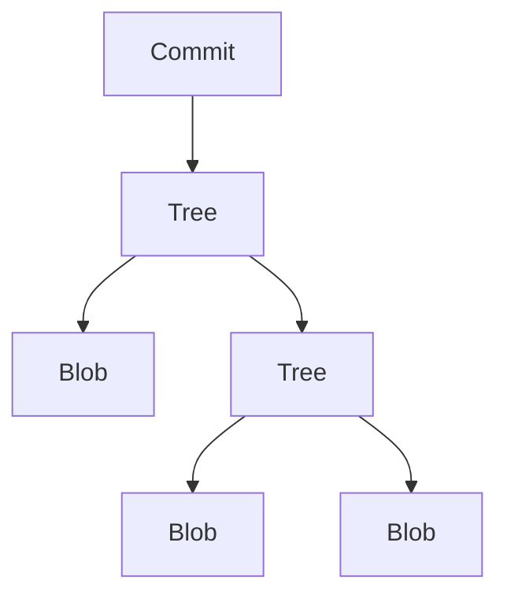

# Arquitectura de Git: Cómo Funciona Por Dentro

Este documento explica los conceptos técnicos detrás de Git. No necesitas esto para usar Git, pero entenderlo te ayudará a:

- Debuggear problemas complejos
- Entender sistemas similares (blockchain, IPFS, etc.)
- Diseñar tus propios sistemas de versionamiento
- Apreciar decisiones de arquitectura elegantes

---

## La Gran Idea: Content-Addressable Storage

Git es fundamentalmente un **sistema de archivos direccionado por contenido** (content-addressable filesystem).

### ¿Qué significa esto?

**Analogía: Biblioteca vs Almacén de ADN**

**Sistema de archivos normal (como una biblioteca):**
```
Estante 3, Fila 2, Libro 5  →  "Don Quijote"
        ↑ ubicación               ↑ contenido
```
- Tú decides DÓNDE poner el libro
- Puedes mover el libro a otro estante
- Dos copias idénticas ocupan dos lugares diferentes
- Si alguien cambia el contenido del libro, sigue en el mismo lugar

**Git (como almacén de ADN):**
```
"Don Quijote" → función hash → a0b659...
   ↑ contenido                    ↑ su "ADN" único
```
- El contenido DETERMINA su identificador
- No eliges el ID, se calcula del contenido
- Dos copias idénticas tienen el mismo ID (se guardan una sola vez)
- Si cambias UNA letra, el ID cambia completamente

### Ejemplo Concreto

```
Sistema normal:
  /docs/nota.txt     contiene "Hola"
  /backup/nota.txt   contiene "Hola"   ← 2 archivos, mismo contenido

Git:
  "Hola" → SHA-1 → f572d396...  ← UN solo objeto
  
  Ambas rutas apuntan al mismo hash.
  No hay duplicación.
```

### La regla fundamental

> **Mismo contenido = Mismo hash = Mismo objeto**
> 
> **Diferente contenido = Diferente hash = Objeto diferente**

Esto significa que el hash funciona como una "huella digital" del contenido. Igual que tu huella digital te identifica únicamente, el hash identifica únicamente un contenido.

### ¿Qué se incluye en el hash? (Importante)

**El nombre del archivo NO es parte del hash del contenido.**

Git separa el contenido de los metadatos:

```
┌─────────────────────────────────────────────────────────────────┐
│  BLOB (contenido)                                               │
│  ─────────────────                                              │
│  hash = SHA-1( "Hola mundo" )  →  a0b659...                    │
│                                                                 │
│  Solo el contenido. Sin nombre. Sin ruta. Sin permisos.        │
└─────────────────────────────────────────────────────────────────┘
          ▲
          │ apunta a
          │
┌─────────────────────────────────────────────────────────────────┐
│  TREE (directorio)                                              │
│  ─────────────────                                              │
│  hash = SHA-1(                                                  │
│    "archivo.txt" + a0b659... +     ← nombre + hash del blob    │
│    "otro.py"     + c3d4e5... +     ← nombre + hash del blob    │
│    "subcarpeta/" + f6g7h8...       ← nombre + hash del tree    │
│  )                                                              │
│                                                                 │
│  El tree SÍ incluye los nombres y los hashes de sus hijos.     │
└─────────────────────────────────────────────────────────────────┘
          ▲
          │ apunta a
          │
┌─────────────────────────────────────────────────────────────────┐
│  COMMIT                                                         │
│  ──────                                                         │
│  hash = SHA-1(                                                  │
│    tree_hash    +    ← apunta al tree raíz                     │
│    parent_hash  +    ← commit anterior (la historia)           │
│    author       +                                               │
│    message                                                      │
│  )                                                              │
└─────────────────────────────────────────────────────────────────┘
```

**¿Por qué separar contenido de nombre?**

```bash
# Dos archivos con el mismo contenido pero diferente nombre:
echo "Hola" > archivo1.txt
echo "Hola" > archivo2.txt

# Git guarda UN solo blob (el contenido "Hola")
# El tree guarda que:
#   - "archivo1.txt" apunta a ese blob
#   - "archivo2.txt" apunta al MISMO blob
```

Esto permite que si tienes 100 archivos con el mismo contenido, Git solo guarda el contenido UNA vez, y 100 punteros en el tree.

### ¿Por qué importa?

| Propiedad | Beneficio |
|-----------|-----------|
| **Integridad** | Si el hash coincide, el contenido no fue alterado |
| **Deduplicación** | Contenido idéntico = mismo hash = se guarda una sola vez |
| **Inmutabilidad** | No puedes modificar algo sin cambiar su dirección |
| **Verificación** | Cualquiera puede verificar la integridad sin confiar en nadie |

> **Aplicación:** Blockchain usa exactamente este principio. Cada bloque tiene un hash que depende del contenido + hash del bloque anterior.

---

## Los Hashes: SHA-1

Git usa SHA-1 para generar identificadores únicos de 40 caracteres hexadecimales.

### ¿Qué es un hash?

Un **hash** es una función que:
1. Toma cualquier cantidad de datos
2. Produce un "fingerprint" de tamaño fijo
3. Es determinista (mismo input → mismo output)
4. Es prácticamente imposible de revertir

```
"Hola"     → SHA-1 → 5ab557c937e38f15291c04b7e99544ad67d7...
"Hola "    → SHA-1 → 99800b85d3383e3a2fb45eb7d0066a4879a4...  (¡totalmente diferente!)
```

### Pruébalo tú mismo

```bash
# Hash de un string
echo -n "Hola mundo" | sha1sum
# a0b65939670bc2c010f4d5d6a0b3e4e4590fb92b

# Cambiar un carácter cambia TODO el hash
echo -n "Hola Mundo" | sha1sum  
# 7e8e0a63d78ce8b05c0c358687a80b7a37cc12fc  (completamente diferente)

# Hash de un archivo
sha1sum archivo.txt
```

### Colisiones

Una **colisión** es cuando dos inputs diferentes producen el mismo hash. Con SHA-1:
- Hay 2^160 posibles hashes
- Es astronómicamente improbable encontrar colisiones por accidente
- Git está migrando a SHA-256 por seguridad adicional

> **Nota técnica:** En 2017 Google demostró la primera colisión SHA-1 intencional, pero requirió recursos computacionales enormes. Para uso práctico, sigue siendo seguro.

---

## Los Tres Objetos de Git

Git almacena todo como **objetos**. Solo hay tres tipos:



### 1. Blob (Binary Large Object)

**Blob** = "Binary Large Object" = un pedazo de datos binarios.

En Git, un blob es **el contenido puro de un archivo**, nada más:

```
┌─────────────────────────────────────────┐
│  Archivo en tu disco:                   │
│  ─────────────────────                  │
│  nombre: "notas.txt"                    │
│  ruta: /home/user/proyecto/notas.txt    │
│  permisos: 644                          │
│  contenido: "Hola mundo"                │
└─────────────────────────────────────────┘
                    │
                    ▼ Git extrae SOLO esto:
┌─────────────────────────────────────────┐
│  Blob en Git:                           │
│  ────────────                           │
│  contenido: "Hola mundo"                │
│  hash: a0b659...                        │
│                                         │
│  (sin nombre, sin ruta, sin permisos)   │
└─────────────────────────────────────────┘
```

**¿Por qué "Binary Large Object"?**
- **Binary:** Puede ser cualquier cosa (texto, imagen, ejecutable)
- **Large:** Puede ser de cualquier tamaño
- **Object:** Es un objeto en la base de datos de Git

Git trata TODO como bytes. No le importa si es código Python, una imagen PNG o un PDF. Solo ve: "estos son los bytes, este es su hash".

```bash
# Ver el hash que tendría un contenido
echo -n "Hola mundo" | git hash-object --stdin
# a0b65939670bc2c010f4d5d6a0b3e4e4590fb92b

# Guardar un blob en Git
echo -n "Hola mundo" | git hash-object -w --stdin

# Ver el contenido de un blob existente
git cat-file -p a0b659...
# Hola mundo
```

**Insight clave:** Git no guarda "archivos", guarda "contenidos". El nombre y la ubicación se guardan en el Tree, no en el Blob.

### 2. Tree (Árbol)

Un **tree** representa un directorio. Contiene:
- Punteros a blobs (archivos)
- Punteros a otros trees (subdirectorios)
- Nombres y permisos

```
tree = [
  (blob, "archivo1.txt", 100644),
  (blob, "archivo2.py", 100644),
  (tree, "subdirectorio", 040000)
]
hash = SHA-1(tree)
```

### 3. Commit

Un **commit** es una "foto" del proyecto. Contiene:
- Puntero a un tree (el estado del proyecto)
- Puntero al commit padre (historia)
- Autor, fecha, mensaje

```
commit = {
  tree: abc123...
  parent: def456...
  author: "Juan <juan@email.com>"
  date: "2026-01-29"
  message: "Agregar función X"
}
hash = SHA-1(commit)
```

### Visualización

```
                    Commit (c3d...)
                       │
                       ▼
                    Tree (a1b...)
                    /    \
                   /      \
            Blob (f4e...) Tree (b2c...)
            "README.md"      │
                            / \
                     Blob    Blob
                    "a.py"  "b.py"
```

---

## Git Local vs Git Remoto (GitHub)

Git es un sistema **distribuido**. Esto significa que hay múltiples copias completas del repositorio:

```
┌─────────────────────────────────────────────────────────────────────────┐
│                           TU COMPUTADORA                                │
│  ┌───────────────┐    ┌───────────────┐    ┌───────────────┐           │
│  │ Working       │    │   Staging     │    │    Local      │           │
│  │ Directory     │───▶│   Area        │───▶│    Repo       │           │
│  │               │add │   (index)     │commit│  (.git/)     │           │
│  │ (tus archivos)│    │               │    │               │           │
│  └───────────────┘    └───────────────┘    └───────────────┘           │
│                                                    │                    │
│                                                    │ push               │
│                                                    ▼                    │
└────────────────────────────────────────────────────┼────────────────────┘
                                                     │
                                        ─ ─ ─ ─ ─ ─ ┼ ─ ─ ─ ─ ─ INTERNET
                                                     │
┌────────────────────────────────────────────────────┼────────────────────┐
│                            GITHUB                  │                    │
│                                                    ▼                    │
│                              ┌───────────────┐                          │
│                              │   Remote      │                          │
│                              │   Repo        │                          │
│                              │  (origin)     │                          │
│                              └───────────────┘                          │
└─────────────────────────────────────────────────────────────────────────┘
```

### Las Tres Áreas Locales

| Área | ¿Qué es? | ¿Dónde está? |
|------|----------|--------------|
| **Working Directory** | Los archivos que ves y editas | Tu carpeta del proyecto |
| **Staging Area (Index)** | "Lista de compras" para el próximo commit | `.git/index` |
| **Local Repository** | Base de datos de Git con toda la historia | `.git/objects/` |

---

## El Staging Area (Index): La Sala de Espera

El **staging area** (también llamado "index") es un concepto único de Git. Es una zona intermedia entre tus archivos y el repositorio.

### ¿Por qué existe?

Imagina que modificaste 10 archivos, pero solo quieres commitear 3. El staging te permite **seleccionar exactamente qué cambios van en cada commit**.

```
Archivos modificados:        Staging Area:           Commit:
───────────────────          ─────────────           ───────
 archivo1.py  ✓ ─────────▶   archivo1.py  ────────▶  Solo estos
 archivo2.py  ✓ ─────────▶   archivo2.py  ────────▶  2 archivos
 archivo3.py  ✗              (no agregado)           
 config.txt   ✗              (no agregado)           
```

### ¿Qué es técnicamente?

El staging area es un **archivo binario** en `.git/index` que contiene:

```
.git/index = [
  (modo, hash_blob, stage, nombre_archivo),
  (100644, a1b2c3..., 0, "archivo1.py"),
  (100644, d4e5f6..., 0, "archivo2.py"),
  ...
]
```

Es básicamente un **Tree pre-construido** que se convertirá en el Tree del próximo commit.

```bash
# Ver el contenido del staging area
git ls-files --stage

# Ejemplo de output:
# 100644 a1b2c3d4e5f6... 0    archivo1.py
# 100644 d4e5f6a1b2c3... 0    archivo2.py
```

---

## ¿Qué pasa cuando ejecutas `git add`?

```bash
git add archivo.py
```

**Paso a paso:**

```
1. Git lee el contenido de archivo.py

2. Calcula el hash SHA-1 del contenido
   contenido = "print('hola')"
   hash = SHA-1(contenido) → a1b2c3d4...

3. Crea un blob en .git/objects/
   .git/objects/a1/b2c3d4... = contenido comprimido

4. Actualiza el index (.git/index)
   Agrega: (100644, a1b2c3d4..., 0, "archivo.py")
```

**Diagrama:**

```
archivo.py ──▶ SHA-1 ──▶ a1b2c3... ──▶ .git/objects/a1/b2c3...
    │                                         ▲
    │                                         │
    └──────────────────────────────────────────
                  git add
                    │
                    ▼
              .git/index
         (archivo.py → a1b2c3...)
```

**Insight:** Después de `git add`, tu contenido YA está guardado en Git como un blob. El commit solo "oficializa" ese estado.

---

## ¿Qué pasa cuando ejecutas `git commit`?

```bash
git commit -m "Agregar función"
```

**Paso a paso:**

```
1. Git lee el index (.git/index)
   
2. Crea un objeto Tree basado en el index
   tree_hash = SHA-1(contenido del tree) → t1r2e3...
   Guarda en: .git/objects/t1/r2e3...

3. Crea un objeto Commit
   commit = {
     tree: t1r2e3...
     parent: (hash del commit anterior)
     author: "Tu Nombre <tu@email.com>"
     date: 2026-01-29
     message: "Agregar función"
   }
   commit_hash = SHA-1(commit) → c0m1t2...
   Guarda en: .git/objects/c0/m1t2...

4. Actualiza la referencia del branch
   .git/refs/heads/main = c0m1t2...
```

**Diagrama:**

```
.git/index ──────────────▶ Tree (t1r2e3...)
                               │
                               ▼
                          Commit (c0m1t2...)
                               │
                               ▼
                    .git/refs/heads/main
                         = c0m1t2...
```

---

## ¿Qué pasa cuando ejecutas `git push`?

```bash
git push origin main
```

**Paso a paso:**

```
1. Git compara tu repo local con el remoto
   "¿Qué objetos tengo yo que no tiene origin?"

2. Empaqueta los objetos nuevos
   - Commits nuevos
   - Trees nuevos  
   - Blobs nuevos

3. Envía el "pack" por HTTPS o SSH a GitHub

4. GitHub:
   - Recibe los objetos
   - Los guarda en su .git/objects/
   - Actualiza refs/heads/main al nuevo commit

5. Tu local actualiza el tracking
   .git/refs/remotes/origin/main = c0m1t2...
```

**Diagrama:**

```
LOCAL                                    GITHUB
─────                                    ──────
.git/objects/                           .git/objects/
  ├── a1/b2c3... (blob)     ────▶         ├── a1/b2c3...
  ├── t1/r2e3... (tree)     ────▶         ├── t1/r2e3...
  └── c0/m1t2... (commit)   ────▶         └── c0/m1t2...

refs/heads/main = c0m1t2... ────▶       refs/heads/main = c0m1t2...
```

**Lo que se transfiere:** Solo los objetos que el remoto no tiene. Git es muy eficiente - nunca envía duplicados.

---

## ¿Qué pasa cuando ejecutas `git pull`?

```bash
git pull origin main
```

Es equivalente a:

```bash
git fetch origin main  # Bajar objetos nuevos
git merge origin/main  # Integrar con tu branch
```

**Fetch:**
```
1. Pregunta a GitHub: "¿Qué commits tienes que yo no?"
2. Descarga los objetos faltantes
3. Actualiza refs/remotes/origin/main
```

**Merge:**
```
1. Encuentra el ancestro común
2. Combina los cambios
3. Crea un nuevo commit de merge (si es necesario)
4. Actualiza refs/heads/main
```

---

## Resumen: El Flujo Completo

```
 EDITAR           ADD              COMMIT            PUSH
────────        ────────         ────────          ────────
                
archivo.py  ──▶  index   ──▶   commit obj  ──▶   GitHub
   │              │              │                  │
   │              │              │                  │
   ▼              ▼              ▼                  ▼
Working       Staging         Local              Remote
Directory      Area           Repo               Repo
(tu carpeta) (.git/index)  (.git/objects)    (github.com)
```

| Comando | De → A | ¿Qué hace técnicamente? |
|---------|--------|-------------------------|
| `git add` | Working → Staging | Crea blob, actualiza index |
| `git commit` | Staging → Local | Crea tree + commit, actualiza branch |
| `git push` | Local → Remote | Transfiere objetos, actualiza refs |
| `git fetch` | Remote → Local | Descarga objetos, actualiza remote refs |
| `git pull` | Remote → Working | fetch + merge |

---

## El DAG: Directed Acyclic Graph

La historia de Git es un **grafo dirigido acíclico** (DAG):

- **Dirigido:** Las flechas van en una dirección (de hijo a padre)
- **Acíclico:** No hay ciclos (no puedes volver al mismo commit siguiendo las flechas)

```
      A ← B ← C ← D    (main)
           ↖
            E ← F      (feature)
```

Cada commit apunta a su(s) padre(s):
- Commits normales: 1 padre
- Merge commits: 2+ padres

### ¿Por qué un DAG?

1. **Eficiencia:** Solo almacenas diferencias
2. **Paralelismo:** Múltiples ramas pueden crecer independientemente
3. **Merge:** Dos líneas de historia se pueden unir
4. **Integridad:** Cambiar un commit antiguo requiere recalcular TODOS los hashes posteriores

> **Aplicación:** Blockchain es también un DAG (generalmente lineal). Cambiar un bloque antiguo invalida toda la cadena posterior.

---

## Branches: Solo Son Punteros

Una **rama** en Git es simplemente un puntero a un commit. Nada más.

```
.git/refs/heads/main     →  c3d4e5f...  (hash del commit)
.git/refs/heads/feature  →  a1b2c3d...
```

### ¿Por qué es brillante?

- Crear una rama = crear un archivo de 40 bytes
- Cambiar de rama = mover un puntero
- Borrar una rama = borrar un archivo

```bash
# Ver que las ramas son solo archivos
cat .git/refs/heads/main
# c3d4e5f67890abcdef1234567890abcdef12345

# HEAD es un puntero al branch actual
cat .git/HEAD
# ref: refs/heads/main
```

### Diagrama

```
                    main ─────┐
                              ▼
    A ← B ← C ← D ← E ← F ← G
              ↖             ▲
               H ← I ← J ───┘
                       ▲
                       └───── feature
```

`main` y `feature` son solo punteros. El historial real son los commits.

---

## La Carpeta .git

Todo Git vive en `.git/`. Veamos qué hay dentro:

```
.git/
├── HEAD              # Puntero al branch actual
├── config            # Configuración del repo
├── index             # Staging area (archivos preparados)
├── objects/          # TODOS los objetos (blobs, trees, commits)
│   ├── pack/         # Objetos comprimidos
│   ├── a1/           # Primeros 2 chars del hash
│   │   └── b2c3d...  # Resto del hash
│   └── ...
└── refs/             # Referencias (branches, tags)
    ├── heads/        # Branches locales
    │   ├── main
    │   └── feature
    ├── remotes/      # Branches remotos
    │   └── origin/
    └── tags/         # Tags
```

### Explorar tu .git

```bash
# Ver la estructura
find .git -type f | head -20

# Ver un objeto
git cat-file -t abc123  # tipo (blob, tree, commit)
git cat-file -p abc123  # contenido

# Ver el log como grafo
git log --oneline --graph --all
```

---

## Integridad: La Cadena de Hashes

Cada hash depende de su contenido, que incluye hashes anteriores:

```
commit_hash = SHA-1(
    tree_hash +
    parent_hash +     ← Este incluye toda la historia
    author +
    message
)
```

**Implicación:** Si alguien modifica un commit antiguo, TODOS los commits posteriores cambian su hash.

```
Original:  A ← B ← C ← D ← E
              ↑
           (modificado)

Nuevo:     A ← B' ← C' ← D' ← E'
```

Esto hace que Git sea **tamper-evident** (evidencia de manipulación). Es imposible modificar la historia sin que se note.

> **Aplicación en blockchain:** Exactamente el mismo principio. Modificar una transacción antigua requiere recalcular todos los bloques posteriores, lo cual es computacionalmente prohibitivo.

---

## Pack Files: Eficiencia de Almacenamiento

Git optimiza el almacenamiento usando **pack files**:

1. **Delta compression:** Guarda diferencias entre objetos similares
2. **Zlib compression:** Comprime el contenido
3. **Packing:** Agrupa objetos en archivos grandes

```bash
# Forzar empaquetado
git gc

# Ver objetos en un pack
git verify-pack -v .git/objects/pack/*.idx | head
```

**Resultado:** Un repo con años de historia puede ocupar menos que el checkout actual.

---

## Conceptos Aplicables a Otros Sistemas

| Concepto Git | Aplicación General |
|--------------|-------------------|
| Content-addressable storage | IPFS, Docker layers, Nix store |
| Merkle trees (árboles de hashes) | Blockchain, certificados, BitTorrent |
| Immutable objects | Bases de datos inmutables, event sourcing |
| DAG | Blockchain, sistemas de dependencias, makefiles |
| Branches como punteros | Sistemas de estados, máquinas de estados |
| Delta compression | Backups incrementales, sync |

---

## Resumen Visual

```
┌─────────────────────────────────────────────────────────────┐
│                        GIT INTERNALS                        │
├─────────────────────────────────────────────────────────────┤
│                                                             │
│   Contenido  ──SHA-1──▶  Hash (40 chars)                   │
│                                                             │
│   ┌────────┐     ┌────────┐     ┌────────┐                │
│   │  Blob  │ ◀── │  Tree  │ ◀── │ Commit │                │
│   │(archivo)│    │ (dir)  │     │ (foto) │                │
│   └────────┘     └────────┘     └────────┘                │
│                                      │                      │
│                                      ▼                      │
│                               Parent Commit                 │
│                                      │                      │
│                                      ▼                      │
│                                    ...                      │
│                                (historia)                   │
│                                                             │
│   Branch = Puntero a un Commit                             │
│   HEAD = Puntero al Branch actual                          │
│                                                             │
└─────────────────────────────────────────────────────────────┘
```

---

## Lecciones de Arquitectura: ¿Qué Aprendemos de Git?

Git no es solo una herramienta - es un **caso de estudio en diseño de sistemas**. Estos principios se aplican mucho más allá del versionamiento de código.

### 1. Inmutabilidad como Fundamento

**Principio:** Los objetos nunca se modifican, solo se crean nuevos.

```
Git:     Commit A → Commit B → Commit C (nunca editas A, creas B y C)
```

**Dónde se aplica:**
- **Bases de datos inmutables** (Datomic, Event Sourcing)
- **Blockchain** (cada bloque es inmutable)
- **Programación funcional** (datos inmutables)
- **Logs de auditoría** (append-only)

**Beneficio:** No hay estados corruptos, siempre puedes reconstruir la historia, debugging más fácil.

---

### 2. Content-Addressable Storage

**Principio:** La dirección de un dato es su contenido (hash).

```
Dato: "Hola" → Dirección: a1b2c3...
```

**Dónde se aplica:**
- **IPFS** (InterPlanetary File System)
- **Docker layers** (cada capa es un hash de su contenido)
- **Nix/Guix** (package managers funcionales)
- **CDNs** (cache por hash de contenido)
- **Deduplicación** en backups (restic, borg)

**Beneficio:** Deduplicación automática, verificación de integridad, cache perfecto.

---

### 3. Grafos Dirigidos Acíclicos (DAG)

**Principio:** La historia es un grafo donde cada nodo apunta a sus padres.

```
    A ← B ← C
         ↖
          D ← E
```

**Dónde se aplica:**
- **Blockchain** (cadena de bloques)
- **Build systems** (Make, Bazel - dependencias)
- **Package managers** (npm, pip - árbol de dependencias)
- **Workflow engines** (Airflow, Prefect)
- **Compiladores** (AST, IR)

**Beneficio:** Paralelización, detección de ciclos, orden de ejecución claro.

---

### 4. Referencias como Indirección

**Principio:** Los nombres (branches) son solo punteros, no datos.

```
main → c3d4e5...  (mover main = cambiar 40 bytes)
```

**Dónde se aplica:**
- **DNS** (nombres → IPs)
- **Symlinks** en filesystems
- **Service discovery** (Consul, etcd)
- **Feature flags** (punteros a configuraciones)
- **Blue-green deployments** (cambiar puntero de producción)

**Beneficio:** Cambios atómicos, rollback instantáneo, bajo costo de operación.

---

### 5. Diseño Distribuido sin Coordinación Central

**Principio:** Cada copia es completa y autónoma. Sincronización eventual.

```
Tu repo ←→ GitHub ←→ Repo de tu compañero
(todos son iguales, no hay "master central")
```

**Dónde se aplica:**
- **CRDTs** (Conflict-free Replicated Data Types)
- **Sistemas P2P** (BitTorrent, blockchain)
- **Bases de datos distribuidas** (CockroachDB, Cassandra)
- **Offline-first apps**

**Beneficio:** Tolerancia a fallos, trabajo offline, escalabilidad horizontal.

---

### 6. Capas de Abstracción Claras

**Principio:** Separar el "qué" del "cómo".

```
Alto nivel:   git commit -m "mensaje"
              ↓
Medio nivel:  crear tree, crear commit, actualizar ref
              ↓
Bajo nivel:   SHA-1, zlib, archivos en .git/objects/
```

**Dónde se aplica:**
- **APIs** (interfaz pública vs implementación)
- **Sistemas operativos** (syscalls vs kernel)
- **Redes** (modelo OSI/TCP-IP)
- **Cualquier software bien diseñado**

**Beneficio:** Puedes cambiar la implementación sin romper la interfaz.

---

### 7. Verificabilidad Criptográfica

**Principio:** Cualquiera puede verificar la integridad sin confiar en nadie.

```
Si el hash coincide → el contenido no fue alterado
(no necesitas confiar en el servidor)
```

**Dónde se aplica:**
- **Blockchain** (verificación de transacciones)
- **Package managers** (checksums de paquetes)
- **Secure boot** (cadena de confianza)
- **Certificados digitales**

**Beneficio:** Zero-trust security, detección de tampering.

---

### Resumen: Patrones Arquitectónicos de Git

| Patrón | Idea Clave | Aplicación General |
|--------|------------|-------------------|
| Inmutabilidad | Nunca modificar, solo crear | Event sourcing, logs |
| Content-addressing | Dirección = hash(contenido) | IPFS, Docker, cache |
| DAG | Grafo de dependencias | Workflows, builds |
| Referencias | Nombres son punteros | DNS, feature flags |
| Distribuido | Sin coordinador central | P2P, offline-first |
| Capas | Separar interfaz de implementación | APIs, abstracciones |
| Verificabilidad | Prueba criptográfica | Blockchain, security |

---

### La Meta-Lección

Git demuestra que con **primitivas simples** (hash, blob, tree, commit, ref) puedes construir un sistema **extremadamente poderoso**.

```
Primitivas simples + Composición inteligente = Sistema robusto
```

Esto es el corazón del buen diseño de software:
- No inventes complejidad innecesaria
- Usa estructuras de datos que resuelvan múltiples problemas
- Haz que la verificación sea automática, no manual
- Diseña para el caso distribuido desde el inicio

> **"Perfection is achieved not when there is nothing more to add, but when there is nothing left to take away."**
> — Antoine de Saint-Exupéry

Git es casi perfecto en este sentido: cada pieza tiene un propósito, nada sobra.

---

## Para Profundizar

Si quieres explorar más:

```bash
# Crear un objeto manualmente
echo "Hola" | git hash-object -w --stdin

# Ver el tipo de un objeto
git cat-file -t <hash>

# Ver contenido
git cat-file -p <hash>

# Ver todos los objetos
find .git/objects -type f

# Ver el DAG completo
git log --all --oneline --graph --decorate
```

---

## Lectura Recomendada

- **Pro Git Book** (gratis): Capítulo 10 "Git Internals"
- **Git from the Bottom Up**: Explicación técnica profunda
- **How Git Works** (Pluralsight): Curso visual

> **La belleza de Git:** Con solo 3 tipos de objetos y hashes SHA-1, se construye un sistema distribuido, eficiente e incorruptible para versionar cualquier tipo de contenido.
