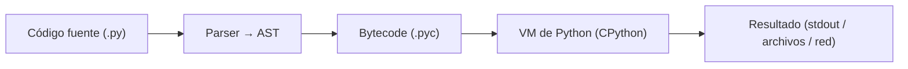

# Introducción a Python

> **Notebook interactivo**: los fundamentos de Python con explicaciones profundas sobre memoria, el intérprete y patrones eficientes están en un notebook ejecutable.
> <a href="https://colab.research.google.com/github/sonder-art/fdd_p26/blob/main/clase/09_python/code/02_fundamentos.ipynb" target="_blank" rel="noopener noreferrer"></a>

Python es el lenguaje dominante en ciencia de datos, machine learning, automatización y scripting. No porque sea el más rápido — no lo es — sino porque es **el más productivo**. La sintaxis es tan limpia que leer Python se parece a leer pseudocódigo.

En esta sección no vamos a escribir programas todavía. Vamos a entender **cómo funciona Python como herramienta**: cómo ejecutarlo, cómo manejar dependencias, y cómo organizar tu entorno de trabajo.

## ¿Qué es Python (sin humo, en 5 min)?

Python es un **lenguaje de alto nivel** diseñado para ser legible y productivo. La mayoría de la gente lo describe como “interpretado”, y en la práctica eso es cierto: normalmente no generas un binario final como en C/C++; ejecutas tu código con `python3`.

Pero la versión correcta (y útil) es esta:

- **Tu archivo `.py` se compila a bytecode** (archivos `.pyc`)  
- Ese bytecode lo ejecuta una **máquina virtual** (la VM de Python)  
- La implementación más común se llama **CPython** (la que obtienes cuando instalas “Python” en la mayoría de sistemas)



> **Conexión con el notebook**: en `02_fundamentos.md` y en el notebook se explica esto con más detalle (bytecode, `dis`, VM y por qué algunas cosas son más rápidas que otras).

### Historia en 60 segundos (solo lo útil)

- **Guido van Rossum** creó Python a finales de los 80 (el nombre viene de *Monty Python*).
- Durante muchos años Guido fue el **BDFL** (*Benevolent Dictator For Life*): tomaba la decisión final de diseño.
- Desde 2018 Python se gobierna más por **PEPs** (*Python Enhancement Proposals*) y el proceso comunitario.

---

## El REPL: tu calculadora interactiva

REPL significa **R**ead-**E**val-**P**rint **L**oop. Es el modo interactivo de Python — escribes una línea, Python la ejecuta, te muestra el resultado, y espera la siguiente.

Para entrar al REPL:

```bash
python3
```

Vas a ver algo como:

```
Python 3.12.x (main, ...)
[GCC 13.x.x] on linux
Type "help", "copyright", "credits" or "license" for more information.
>>>
```

Los `>>>` son el **prompt** — ahí escribes código:

```python
>>> 2 + 2
4
>>> "hola" * 3
'holaholahola'
>>> len("Python")
6
>>> type(3.14)
<class 'float'>
```

Para salir:

```python
>>> exit()
```

O presiona `Ctrl+D`.

### ¿Para qué sirve el REPL?

- **Probar ideas rápido** — ¿cómo funciona esta función? Pruébala en el REPL
- **Explorar datos** — carga un archivo y explora su contenido interactivamente
- **Calculadora** — más poderosa que cualquier calculadora de escritorio
- **Debugging** — prueba fragmentos de código aislados

El REPL es desechable: nada se guarda cuando sales. Para código que quieras conservar, usas **scripts**.

---

## Scripts: archivos `.py`

Un script es un archivo de texto con extensión `.py` que contiene código Python. Lo ejecutas desde la terminal:

```bash
python3 mi_script.py
```

Python lee el archivo de arriba a abajo y ejecuta cada línea en orden. No hay función `main()` obligatoria ni compilación — el archivo **es** el programa.

### Ejemplo mínimo

Crea un archivo `hola.py`:

```python
nombre = "mundo"
print(f"Hola, {nombre}!")
```

Ejecútalo:

```bash
python3 hola.py
# Hola, mundo!
```

### REPL vs Script

| Aspecto | REPL | Script |
|---------|------|--------|
| **Persistencia** | Se pierde al salir | Se guarda en archivo |
| **Uso** | Explorar, probar, debuggear | Programas reales |
| **Ejecución** | Línea por línea | Archivo completo |
| **Resultado** | Se imprime automáticamente | Necesitas `print()` |

Esa última diferencia es importante. En el REPL:

```python
>>> 2 + 2
4           # ← se imprime automáticamente
```

En un script:

```python
2 + 2       # ← no pasa nada visible
print(2 + 2)  # ← ahora sí: 4
```

---

## El Zen de Python

Python tiene una filosofía de diseño escrita en un "easter egg". Abre el REPL y escribe:

```python
>>> import this
```

Vas a ver:

```
The Zen of Python, by Tim Peters

Beautiful is better than ugly.
Explicit is better than implicit.
Simple is better than complex.
Complex is better than complicated.
Flat is better than nested.
Sparse is better than dense.
Readability counts.
Special cases aren't special enough to break the rules.
Although practicality beats purity.
Errors should never pass silently.
Unless explicitly silenced.
In the face of ambiguity, refuse the temptation to guess.
There should be one-- and preferably only one --obvious way to do it.
Although that way may not be obvious at first unless you're Dutch.
Now is better than never.
Although never is often better than *right* now.
If the implementation is hard to explain, it's a bad idea.
If the implementation is easy to explain, it may be a good idea.
Namespaces are one honking great idea -- let's do more of those!
```

Estos 19 aforismos guían el diseño de Python. Los más importantes para ti ahora:

- **"Readability counts"** — escribe código que otros (y tú en 3 meses) puedan leer
- **"Simple is better than complex"** — no uses una herramienta compleja cuando una simple funciona
- **"Explicit is better than implicit"** — sé claro en lo que hace tu código, no dependas de magia
- **"Errors should never pass silently"** — si algo falla, que falle ruidosamente

Esto no es poesía decorativa — es la razón por la que Python se ve y se siente como se ve. Cuando tengas duda entre dos formas de escribir algo, elige la más legible.

---

## Versiones de Python

Python tiene dos grandes versiones: **Python 2** y **Python 3**. Python 2 murió oficialmente el 1 de enero de 2020. **Solo usa Python 3.**

Pero dentro de Python 3 hay subversiones: 3.10, 3.11, 3.12, 3.13... Cada una agrega funcionalidades nuevas. En este curso usaremos **Python 3.10+** (cualquier versión 3.10 o superior).

Verifica tu versión:

```bash
python3 --version
# Python 3.12.x
```

> **IMPORTANTE**: En algunos sistemas, `python` apunta a Python 2 y `python3` a Python 3. Siempre usa `python3` para estar seguro. Si solo tienes Python 3 instalado, `python` y `python3` son equivalentes.

### pyenv: manejar múltiples versiones

¿Qué pasa si un proyecto necesita Python 3.10 y otro necesita Python 3.12? Para eso existe **pyenv** — un gestor de versiones de Python.

```bash
# Ver versiones disponibles
pyenv install --list | grep "3.1"

# Instalar una versión específica
pyenv install 3.12.4

# Ver versiones instaladas
pyenv versions

# Usar una versión globalmente
pyenv global 3.12.4

# Usar una versión solo en un directorio
cd mi-proyecto
pyenv local 3.10.14
# Crea un archivo .python-version en el directorio
```

Con `pyenv local`, cada vez que entres a ese directorio, Python usará la versión especificada. Esto es útil cuando trabajas en varios proyectos con versiones diferentes.

> **Nota**: `pyenv` compila Python desde el código fuente. La primera instalación de una versión puede tardar unos minutos.

---

## pip: instalar paquetes

Python viene con una biblioteca estándar enorme (batteries included), pero para ciencia de datos necesitas paquetes externos: `pandas`, `numpy`, `requests`, `matplotlib`, etc.

**pip** es el gestor de paquetes estándar de Python. Viene incluido con Python 3.

```bash
# Instalar un paquete
pip install requests

# Instalar una versión específica
pip install requests==2.31.0

# Instalar varios paquetes
pip install pandas numpy matplotlib

# Ver paquetes instalados
pip list

# Ver información de un paquete
pip show requests

# Desinstalar
pip uninstall requests
```

### ¿De dónde vienen los paquetes?

De **PyPI** (Python Package Index) — el repositorio central de paquetes de Python. Cuando haces `pip install pandas`, pip descarga `pandas` de PyPI y lo instala en tu sistema.

PyPI tiene más de 500,000 paquetes. Cualquiera puede publicar un paquete.

### requirements.txt

Cuando trabajas en un proyecto con otras personas, necesitas una forma de decir "mi proyecto necesita estos paquetes en estas versiones". Para eso existe `requirements.txt`:

```
requests==2.31.0
pandas==2.1.4
numpy==1.26.2
matplotlib==3.8.2
```

Cualquier persona puede instalar todas las dependencias con:

```bash
pip install -r requirements.txt
```

Para generar un `requirements.txt` con todo lo que tienes instalado:

```bash
pip freeze > requirements.txt
```

> **Cuidado con `pip freeze`**: exporta **todo** lo que está instalado, incluyendo dependencias de dependencias. Para proyectos reales, es mejor mantener el `requirements.txt` manualmente con solo las dependencias directas.

---

## Entornos virtuales: aislamiento de dependencias

Imagina esto: el Proyecto A necesita `requests==2.28` y el Proyecto B necesita `requests==2.31`. Si instalas ambos con `pip install`, el segundo sobreescribe al primero. **Conflicto.**

La solución: **entornos virtuales**. Un entorno virtual es una copia aislada de Python con sus propios paquetes. Cada proyecto tiene su propio entorno, y los paquetes de uno no interfieren con los del otro.

```
Sistema
├── Python 3.12
│
├── Proyecto A/
│   └── venv/          ← requests==2.28, pandas==2.0
│
├── Proyecto B/
│   └── venv/          ← requests==2.31, pandas==2.1
│
└── Proyecto C/
    └── venv/          ← flask==3.0, sin pandas
```

### Crear y usar un entorno virtual

Python incluye `venv` para crear entornos virtuales:

```bash
# Crear un entorno virtual (se crea un directorio llamado "venv")
python3 -m venv venv

# Activar el entorno virtual
source venv/bin/activate
# En Windows: venv\Scripts\activate

# Tu prompt cambia para indicar que estás en el entorno:
# (venv) usuario@maquina:~/proyecto$

# Ahora pip instala SOLO en este entorno
pip install requests pandas

# Ver qué hay instalado (solo lo de este entorno)
pip list

# Desactivar el entorno virtual
deactivate
```

### ¿Qué hay dentro de `venv/` (o `.venv/`)?

Un entorno virtual es (básicamente) un directorio con:

```
venv/ o .venv/
├── bin/                # ejecutables: python, pip, activate, etc.
├── lib/                # librerías del entorno
│   └── python3.X/
│       └── site-packages/   # aquí se instalan los paquetes
└── pyvenv.cfg          # metadata: versión, ruta base, etc.
```

### ¿Qué hace realmente “activar” el entorno?

Cuando ejecutas:

```bash
source venv/bin/activate
```

no “metes Python dentro de otro Python”. Lo que pasa es más simple: tu shell ajusta variables de entorno (principalmente **`PATH`**) para que al escribir `python`/`pip` se usen los del entorno.


### Cómo verificar que estás usando el Python correcto (debugging esencial)

Estos comandos te dicen exactamente qué ejecutable y qué pip estás usando:

```bash
which python
python -c "import sys; print(sys.executable)"
python -m pip --version
```

### Reglas de oro

1. **NUNCA instales paquetes sin un entorno virtual activo** — contaminás el Python global del sistema
2. **NUNCA subas el directorio `venv/` a git** — agrégalo al `.gitignore`
3. **SÍ sube tu `requirements.txt`** — es la receta para recrear el entorno

El flujo correcto para empezar a trabajar en un proyecto:

```bash
# Clonar el proyecto
git clone https://github.com/usuario/proyecto.git
cd proyecto

# Crear entorno virtual
python3 -m venv venv
source venv/bin/activate

# Instalar dependencias
pip install -r requirements.txt

# Trabajar...

# Al terminar
deactivate
```

---

## uv: pip pero rápido

**uv** es un reemplazo moderno de pip escrito en Rust. Hace lo mismo que pip + venv pero **mucho más rápido** (10-100x). También integra el manejo de versiones de Python (como pyenv).

### Instalar uv

```bash
# En Linux/macOS
curl -LsSf https://astral.sh/uv/install.sh | sh

# Verificar
uv --version
```

### Usar uv como reemplazo de pip + venv

```bash
# Crear un entorno virtual
uv venv

# Activar (igual que con venv estándar)
source .venv/bin/activate

# Instalar paquetes (sintaxis idéntica a pip)
uv pip install requests pandas numpy

# Instalar desde requirements.txt
uv pip install -r requirements.txt

# Generar requirements.txt
uv pip freeze > requirements.txt

# Desactivar
deactivate
```

> **Nota**: `uv venv` crea el directorio como `.venv` (con punto) en vez de `venv`. Es una convención más moderna — el punto lo oculta en `ls`.

### uv como gestor de proyectos

uv también puede manejar proyectos completos con un archivo `pyproject.toml`:

```bash
# Inicializar un proyecto nuevo
uv init mi-proyecto
cd mi-proyecto

# Agregar dependencias
uv add requests
uv add pandas numpy

# Ejecutar scripts sin activar manualmente el entorno
uv run python mi_script.py

# Instalar una versión de Python específica
uv python install 3.12
```

Con `uv init`, la estructura del proyecto queda:

```
mi-proyecto/
├── pyproject.toml     ← define dependencias y metadata
├── .venv/             ← entorno virtual (gitignored)
├── .python-version    ← versión de Python para este proyecto
└── hello.py           ← tu código
```

El archivo `pyproject.toml` es el estándar moderno para definir proyectos Python. Reemplaza al combo `setup.py` + `requirements.txt` con un solo archivo:

```toml
[project]
name = "mi-proyecto"
version = "0.1.0"
requires-python = ">=3.12"
dependencies = [
    "requests>=2.31",
    "pandas>=2.1",
]
```

### ¿pip o uv?

| Aspecto | pip + venv | uv |
|---------|------------|-----|
| **Velocidad** | Lento (Python puro) | Muy rápido (Rust) |
| **Viene con Python** | Sí | No, hay que instalarlo |
| **Entornos virtuales** | `python3 -m venv` | `uv venv` |
| **Manejo de versiones Python** | No (necesitas pyenv) | Sí (`uv python install`) |
| **pyproject.toml** | No directamente | Sí (`uv init`, `uv add`) |
| **Estándar de la industria** | Sí, universal | Creciendo rápido |

**Recomendación para este curso**: usa **uv** como tu herramienta principal. Es más rápido y moderno. Pero **entiende pip** porque lo vas a encontrar en todos lados — documentación, tutoriales, proyectos existentes, Docker containers.

---

## Resumen: el flujo de trabajo con Python

```mermaid
graph TD
    A[Instalar Python] --> B[Crear proyecto]
    B --> C{¿Nuevo proyecto?}
    C -->|Sí| D[uv init / python3 -m venv venv]
    C -->|No, cloné uno| E[uv venv + uv pip install -r requirements.txt]
    D --> F[Activar entorno virtual]
    E --> F
    F --> G[Escribir código en .py]
    G --> H[Ejecutar: python3 script.py]
    H --> I{¿Necesito un paquete nuevo?}
    I -->|Sí| J[uv pip install paquete / uv add paquete]
    J --> G
    I -->|No| K[Actualizar requirements.txt]
    K --> L[git add + commit + push]

    style A fill:#4a3080,stroke:#7c5cbf
    style D fill:#2d5a1e,stroke:#4a8f32
    style E fill:#2d5a1e,stroke:#4a8f32
    style F fill:#1a3a5c,stroke:#2a6a9c
    style G fill:#4a3080,stroke:#7c5cbf
    style L fill:#2d5a1e,stroke:#4a8f32
```



1. **Instala Python** (y `uv` para velocidad)
2. **Crea un entorno virtual** para cada proyecto
3. **Activa el entorno** antes de trabajar
4. **Instala dependencias** dentro del entorno
5. **Escribe y ejecuta** scripts `.py`
6. **Guarda las dependencias** en `requirements.txt` o `pyproject.toml`
7. **Nunca subas** `venv/` o `.venv/` a git

---

:::exercise{title="Tu entorno de Python" difficulty="1"}

1. Verifica tu versión de Python:

```bash
python3 --version
```

2. Abre el REPL y ejecuta:

```python
>>> import this
```

Lee el Zen de Python. ¿Cuál de los 19 aforismos te parece más útil? No hay respuesta incorrecta.

3. Sal del REPL (`exit()` o `Ctrl+D`).

4. Crea un directorio de prueba y un entorno virtual:

```bash
mkdir prueba-python
cd prueba-python
python3 -m venv venv
source venv/bin/activate
```

5. Instala un paquete y verifica:

```bash
pip install requests
pip list
```

6. Genera un `requirements.txt`:

```bash
pip freeze > requirements.txt
cat requirements.txt
```

7. Desactiva el entorno:

```bash
deactivate
```

8. Repite los pasos 4-7 pero usando **uv** en lugar de pip + venv:

```bash
cd ..
mkdir prueba-uv
cd prueba-uv
uv venv
source .venv/bin/activate
uv pip install requests
uv pip freeze > requirements.txt
deactivate
```

¿Notaste la diferencia de velocidad?

:::

:::exercise{title="Proyecto con uv init" difficulty="2"}

1. Crea un proyecto con uv:

```bash
uv init mi-primer-proyecto
cd mi-primer-proyecto
```

2. Observa los archivos creados:

```bash
ls -la
cat pyproject.toml
```

3. Agrega una dependencia:

```bash
uv add requests
```

4. Revisa cómo cambió `pyproject.toml`:

```bash
cat pyproject.toml
```

5. Crea un script `consulta.py`:

```python
import requests

resp = requests.get("https://httpbin.org/ip")
print(f"Tu IP pública: {resp.json()['origin']}")
```

6. Ejecútalo con `uv run` (no necesitas activar el entorno manualmente):

```bash
uv run python consulta.py
```

7. Compara: ¿qué diferencias hay entre manejar dependencias con `requirements.txt` vs `pyproject.toml`?

:::

:::prompt{title="Configurar entorno Python para ciencia de datos" for="ChatGPT/Claude"}

Necesito configurar un entorno de Python para ciencia de datos en mi máquina.

Mi sistema operativo es: [Linux / macOS / Windows con WSL2]
Mi versión de Python es: [resultado de python3 --version]
Tengo instalado: [pip / uv / pyenv / ninguno]

Necesito instalar y configurar:
1. Un entorno virtual para mi proyecto
2. Las siguientes librerías: pandas, numpy, matplotlib, jupyter
3. Un `requirements.txt` que pueda compartir con mi equipo

¿Cuál es el proceso paso a paso? Si hay algún problema común con mi sistema operativo, menciónalo.

:::
