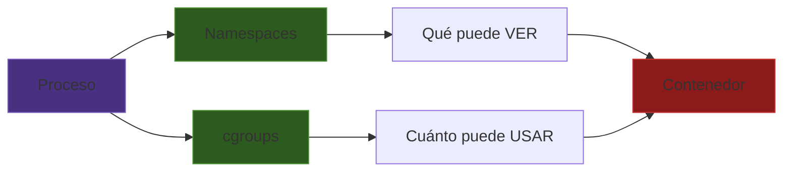

# ¿Qué son los contenedores?

:::homework{id="01.01" title="Certificado de Docker basico" due="2026-02-12" points="20"}
Hacer el curso de Docker basico de datacamp y subir el certificado pr github en pull request y agregar la direccion del pull request y el file en github (los links) en canvas.  
https://app.datacamp.com/learn/courses/introduction-to-docker 
:::

## La analogía del contenedor de carga

Antes de los contenedores de carga estandarizados, transportar mercancía era un caos. Cada producto tenía su propia forma de empaquetarse, cada barco cargaba de manera distinta, y transferir carga entre barco, tren y camión requería desempacar y reempacar todo.

En 1956, Malcolm McLean inventó el **contenedor intermodal**: una caja metálica estándar que funciona igual en un barco, un tren o un camión. No importa qué hay adentro — el contenedor tiene la misma forma, el mismo tamaño, y se maneja con las mismas grúas.

Los contenedores de software funcionan exactamente igual:

| Contenedor de carga | Contenedor de software |
|---------------------|----------------------|
| Caja metálica estándar | Formato estándar (OCI) |
| Funciona en barco, tren, camión | Funciona en Linux, macOS, Windows, nube |
| No importa qué hay adentro | No importa qué lenguaje o dependencias tiene |
| Se maneja con grúas estándar | Se maneja con Docker, Podman, Kubernetes |
| Aísla la carga del exterior | Aísla el proceso del sistema host |

## Definición técnica

Un contenedor es un **proceso aislado** que corre en tu sistema operativo. A diferencia de una máquina virtual, un contenedor **no tiene su propio kernel** — comparte el kernel del sistema host, pero tiene su propia vista aislada de:

- Sistema de archivos
- Procesos (PIDs)
- Red
- Usuarios
- Recursos (CPU, memoria)

Esta aislación se logra con dos mecanismos del kernel de Linux: **namespaces** y **cgroups**.

## Máquinas Virtuales vs Contenedores

La diferencia fundamental es **dónde ocurre la aislación**.

### Arquitectura de una Máquina Virtual

```mermaid
graph TB
    subgraph VM1[VM 1]
        A1[Aplicación] --> O1[Sistema Operativo Completo]
    end
    subgraph VM2[VM 2]
        A2[Aplicación] --> O2[Sistema Operativo Completo]
    end
    VM1 --> H[Hypervisor]
    VM2 --> H
    H --> HW[Hardware]

    style VM1 fill:#4a3080,stroke:#7c5cbf
    style VM2 fill:#4a3080,stroke:#7c5cbf
    style H fill:#2d5a1e,stroke:#4a8f32
    style HW fill:#1a1a2e,stroke:#333
```



Una VM virtualiza **todo el hardware**. Cada VM tiene su propio sistema operativo, su propio kernel, sus propios drivers. Es como tener una computadora completa dentro de tu computadora.

### Arquitectura de Contenedores

```mermaid
graph TB
    subgraph C1[Contenedor 1]
        A1[Aplicación + Dependencias]
    end
    subgraph C2[Contenedor 2]
        A2[Aplicación + Dependencias]
    end
    C1 --> CR[Container Runtime]
    C2 --> CR
    CR --> K[Kernel del Host]
    K --> HW[Hardware]

    style C1 fill:#4a3080,stroke:#7c5cbf
    style C2 fill:#4a3080,stroke:#7c5cbf
    style CR fill:#2d5a1e,stroke:#4a8f32
    style K fill:#1a3a5c,stroke:#2a6a9c
    style HW fill:#1a1a2e,stroke:#333
```



Un contenedor virtualiza **solo el sistema operativo**. Todos los contenedores comparten el mismo kernel. Solo empaquetan la aplicación y sus dependencias.

### Comparación técnica

| Aspecto | Máquina Virtual | Contenedor |
|---------|----------------|------------|
| **Aislación** | Hardware virtualizado completo | Namespaces del kernel |
| **Tamaño** | GBs (SO completo) | MBs (solo app + deps) |
| **Startup** | Minutos (boot completo) | Segundos o menos |
| **Overhead** | Alto (hypervisor + SO) | Mínimo (proceso nativo) |
| **Kernel** | Propio por cada VM | Compartido con el host |
| **Seguridad** | Fuerte (aislación de hardware) | Buena (aislación de kernel) |
| **Densidad** | ~10s de VMs por host | ~100s de contenedores por host |

### Comparación de arquitectura y orquestación

| Aspecto | Máquina Virtual | Contenedor |
|---------|----------------|------------|
| **Portabilidad** | Imágenes pesadas, formatos propietarios | Imágenes ligeras, formato OCI estándar |
| **Escalabilidad** | Lenta (arrancar VM toma minutos) | Rápida (arrancar contenedor toma segundos) |
| **Microservicios** | Un servicio por VM es muy costoso | Un servicio por contenedor es eficiente |
| **CI/CD** | Ambientes pesados de recrear | Ambientes desechables y reproducibles |
| **Orquestación** | vSphere, OpenStack | Kubernetes, Docker Swarm |

### ¿Cuándo usar cada uno?

- **VM**: Necesitas un SO diferente (Windows en Linux), necesitas aislación fuerte de seguridad, corres software legacy que necesita un kernel específico.
- **Contenedor**: Despliegue de aplicaciones, microservicios, pipelines de datos, ambientes de desarrollo, CI/CD.

## Namespaces y cgroups

No necesitas entender los detalles internos para **usar** contenedores, pero saber que existen te ayuda a entender **por qué** funcionan como funcionan.

Ya vimos que un contenedor es un proceso aislado que comparte el kernel del host. Pero, ¿cómo logra el kernel aislar un proceso del resto del sistema? Con dos mecanismos: **namespaces** y **cgroups**. Cada uno resuelve una pregunta distinta:

- **Namespaces** -> ¿Qué puede **ver** el proceso?
- **cgroups** -> ¿Cuánto puede **usar** el proceso?

### Namespaces: aislación de visibilidad

Normalmente, cualquier proceso en Linux puede ver a todos los demás procesos, la red completa, y el sistema de archivos entero. Los **namespaces** cambian esto: le dan a un proceso **su propia vista privada** de una parte del sistema.

Imagina que vives en un departamento. El edificio (kernel) es uno solo, pero cada departamento (namespace) tiene su propia puerta, su propio número, y desde adentro no puedes ver lo que pasa en el departamento de al lado. Los namespaces funcionan igual: el kernel es uno solo, pero cada contenedor tiene su propia "ventana" al sistema.

Linux ofrece varios tipos de namespaces, cada uno aísla un aspecto diferente:

| Namespace | ¿Qué aísla? | Sin namespace | Con namespace |
|-----------|-------------|---------------|---------------|
| **PID** | Procesos | El proceso ve todos los procesos del sistema | El proceso solo ve los suyos; cree que es PID 1 |
| **NET** | Red | El proceso comparte IP y puertos con todos | El proceso tiene su propia IP y puertos |
| **MNT** | Sistema de archivos | El proceso ve todo el disco | El proceso ve solo su propio `/`, como si fuera otra máquina |
| **USER** | Usuarios | root es root en todo el sistema | root dentro del contenedor **no** es root en el host |
| **UTS** | Hostname | Todos comparten el nombre de la máquina | El proceso tiene su propio hostname |
| **IPC** | Comunicación entre procesos | Cualquier proceso puede comunicarse con otro vía memoria compartida | La memoria compartida es privada por contenedor |

### cgroups: limitación de recursos

Los namespaces controlan lo que un proceso puede *ver*, pero no lo que puede *consumir*. Sin restricciones, un solo contenedor podría usar toda la memoria RAM o acaparar todos los cores del CPU, afectando a los demás contenedores y al propio host.

Los **cgroups** (abreviación de *control groups*) resuelven esto: son el mecanismo del kernel que pone **límites cuantitativos** a los recursos que un proceso puede usar. Piensa en los cgroups como el medidor de luz de tu departamento: puedes usar electricidad, pero si te pasas del límite, se corta.

```bash
# Ejemplo: limitar un contenedor a 512MB de RAM y 1 CPU
docker run --memory=512m --cpus=1 ubuntu sleep infinity
```

Los cgroups controlan:
- **Memoria**: límite máximo, swap
- **CPU**: porcentaje, cores específicos
- **I/O**: velocidad de lectura/escritura a disco
- **PIDs**: número máximo de procesos

### Namespaces + cgroups = contenedor



Un contenedor no es magia — es un proceso normal de Linux con **restricciones de visibilidad** (namespaces) y **restricciones de recursos** (cgroups). Docker y Podman son herramientas que configuran estas restricciones por ti.

## ¿Cuándo NO usar contenedores?

Los contenedores no son la solución a todo. Evítalos cuando:

- **Necesitas acceso directo a hardware** — GPUs, USB, hardware especializado (posible pero complejo)
- **Tu aplicación es un simple script** — si no tiene dependencias, un contenedor es overhead innecesario
- **Necesitas máxima seguridad** — la aislación de contenedores es buena pero no tan fuerte como una VM
- **Necesitas un kernel diferente** — contenedores Linux no corren en un kernel Windows (necesitas una VM intermedia)
- **Estado persistente complejo** — bases de datos en contenedores requieren configuración cuidadosa de volúmenes

## Ejercicios

:::exercise{title="Pensamiento: VMs vs contenedores" difficulty="1"}

Responde las siguientes preguntas **sin buscar en internet** (piensa primero, luego verifica):

1. ¿Por qué un contenedor arranca en segundos pero una VM tarda minutos?
2. Si un contenedor comparte el kernel del host, ¿puede un contenedor Linux correr en Windows directamente? ¿Qué necesitaría?
3. Un investigador quiere correr su análisis de datos de forma reproducible. ¿Le recomendarías una VM o un contenedor? ¿Por qué?
4. ¿Qué pasaría si un contenedor no tuviera cgroups y ejecutara un proceso que consume toda la memoria?

:::

:::exercise{title="Namespaces en acción" difficulty="2"}

Vamos a ver los namespaces de un contenedor en tiempo real.

1. Lanza un contenedor en segundo plano:

```bash
docker run -d --name ns_test ubuntu sleep 3600
```

2. Encuentra el PID del contenedor en el host:


```bash
docker inspect --format '{{.State.Pid}}' ns_test
```


3. Compara los namespaces del contenedor con los del host:

```bash
# Namespaces del proceso del contenedor
sudo ls -la /proc/<PID_DEL_CONTENEDOR>/ns/

# Namespaces de un proceso del host (usa PID 1)
sudo ls -la /proc/1/ns/
```

4. ¿Los IDs de los namespaces son iguales o diferentes? ¿Cuáles son diferentes?

5. Limpia:

```bash
docker stop ns_test && docker rm ns_test
```

:::

:::prompt{title="Entender namespaces y cgroups" for="ChatGPT/Claude"}

Estoy aprendiendo sobre contenedores. Entiendo que los contenedores usan namespaces y cgroups del kernel de Linux.

Necesito que me expliques:

1. ¿Qué pasa exactamente cuando un contenedor ve su proceso como PID 1? ¿Cómo funciona el namespace PID?
2. ¿Cómo se ve esto desde el host? ¿El host ve el proceso del contenedor?
3. Si pongo `--memory=256m` en un contenedor, ¿qué pasa si el proceso intenta usar más de 256MB?

Explícame con ejemplos concretos, no solo teoría.

:::
