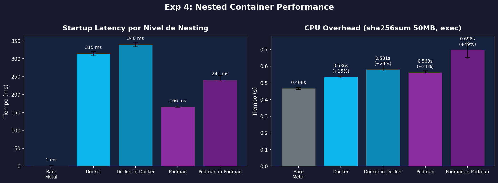

# Contenedores anidados

¿Qué pasa cuando ejecutas un contenedor **dentro** de otro contenedor? Esto no es un ejercicio teórico — es algo que ocurre constantemente en CI/CD (Jenkins, GitHub Actions, GitLab CI) y en herramientas como Testcontainers. Entender cómo funciona y cuánto cuesta es importante.

## ¿Por qué anidar contenedores?

El caso más común: tu pipeline de CI/CD corre **dentro de un contenedor** (para aislamiento), y necesita **construir o ejecutar otros contenedores** (para testing, builds, deploys).

```
┌─ Host ─────────────────────────────────────────┐
│                                                 │
│  ┌─ CI Container ─────────────────────────────┐ │
│  │  Jenkins / GitHub Actions / GitLab Runner   │ │
│  │                                             │ │
│  │  ┌─ App Container ──────┐                   │ │
│  │  │  docker build -t app │  ← tu app         │ │
│  │  └──────────────────────┘                   │ │
│  │                                             │ │
│  │  ┌─ Test DB ────────────┐                   │ │
│  │  │  docker run postgres │  ← test database  │ │
│  │  └──────────────────────┘                   │ │
│  └─────────────────────────────────────────────┘ │
└─────────────────────────────────────────────────┘
```

Hay **tres formas** de lograr esto, cada una con trade-offs diferentes.

---

## Forma 1: Docker-in-Docker (DinD)

DinD ejecuta un **daemon Docker completo** dentro de un contenedor. El contenedor hijo tiene su propio `dockerd`, su propio almacenamiento de imágenes, y sus propios contenedores.

```bash
# Levantar un contenedor con Docker daemon adentro
docker run -d --privileged --name mi-dind docker:dind
```

> **`--privileged` es OBLIGATORIO** — DinD necesita acceso completo al kernel para crear namespaces y cgroups dentro de namespaces ya existentes. Sin este flag, falla.

Espera a que el daemon arranque:

```bash
# Esperar hasta que dockerd responda
for i in $(seq 1 15); do
    docker exec mi-dind docker info > /dev/null 2>&1 && break
    sleep 1
done
echo "DinD listo"
```

Ahora puedes usar Docker **dentro** del contenedor:

```bash
# Desde tu host, ejecutar comandos Docker DENTRO del DinD
docker exec mi-dind docker pull alpine
docker exec mi-dind docker run --rm alpine echo "hola desde nivel 2"
# hola desde nivel 2

# Ver imágenes del Docker INTERNO (separadas del host)
docker exec mi-dind docker images
# REPOSITORY   TAG       IMAGE ID       SIZE
# alpine       latest    ...            7.38MB

# Ver imágenes del host — son DIFERENTES
docker images | grep alpine
# alpine       latest    ...            7.38MB  ← copia separada
```

**Lo importante**: el Docker interno es **completamente independiente** del Docker del host. Tiene sus propias imágenes, sus propios contenedores, su propio almacenamiento. Nada se comparte.

```
Host Docker                    DinD Docker (dentro del contenedor)
┌──────────┐                  ┌──────────┐
│ dockerd  │                  │ dockerd  │  ← daemon SEPARADO
│ images:  │                  │ images:  │  ← imágenes SEPARADAS
│  alpine  │                  │  alpine  │  ← copia independiente
│  ubuntu  │                  │          │
└──────────┘                  └──────────┘
```

### Limpiar

```bash
docker stop mi-dind
docker rm mi-dind
```

---

## Forma 2: Socket mounting (contenedores hermanos)

En vez de correr un Docker daemon dentro del contenedor, puedes **montar el socket** del Docker del host:

```bash
docker run --rm \
    -v /var/run/docker.sock:/var/run/docker.sock \
    docker:cli \
    docker run --rm alpine echo "hola desde un hermano"
# hola desde un hermano
```

Esto **no** es anidamiento real — el `docker run` dentro del contenedor habla con el **daemon del host**. El contenedor `alpine` creado es un **hermano** (sibling), no un hijo:

```
Host Docker daemon
├── tu contenedor (docker:cli con socket montado)
├── alpine (creado "desde dentro" pero es un hermano)  ← nivel 1, NO nivel 2
```

**Ventaja**: sin overhead extra, sin `--privileged`, misma velocidad que Docker normal.

**Desventaja**: no hay aislamiento — el contenedor con el socket puede ver y controlar **todos** los contenedores del host. Es un riesgo de seguridad significativo.

```bash
# ¡PELIGRO! Desde el contenedor puedes ver TODO
docker run --rm \
    -v /var/run/docker.sock:/var/run/docker.sock \
    docker:cli \
    docker ps -a
# Ves TODOS los contenedores del host
```

---

## Forma 3: Podman-in-Podman

Podman tiene una ventaja arquitectónica para anidamiento: **no tiene daemon**. Cada `podman run` es un proceso independiente, lo que hace el anidamiento más natural.

```bash
# Levantar un contenedor Podman con capacidad de ejecutar Podman adentro
podman run -d --privileged --name mi-podman-nest quay.io/podman/stable sleep 3600
```

Ahora puedes usar Podman dentro:

```bash
# Pull y run dentro del contenedor
podman exec mi-podman-nest podman pull alpine
podman exec mi-podman-nest podman run --rm alpine echo "hola desde podman anidado"
# hola desde podman anidado
```

Al igual que DinD, el Podman interno es independiente — sus imágenes y contenedores son separados del host.

### Limpiar

```bash
podman stop mi-podman-nest
podman rm mi-podman-nest
```

---

## Comparación: DinD vs Socket vs Podman anidado

| | DinD | Socket mount | Podman anidado |
|---|---|---|---|
| **Anidamiento real** | Sí (daemon dentro de daemon) | No (hermanos) | Sí (proceso dentro de proceso) |
| **Requiere --privileged** | Sí | No | Sí |
| **Aislamiento** | Total | Ninguno | Total |
| **Imágenes compartidas** | No (pull doble) | Sí (mismo daemon) | No (pull doble) |
| **Overhead** | Alto (daemon extra) | Mínimo | Medio |
| **Riesgo de seguridad** | Medio (privileged) | **Alto** (acceso total al host) | Medio (privileged) |

---

## Performance: ¿cuánto cuesta anidar?

Ejecutamos dos benchmarks para medir el costo real del anidamiento:

1. **Startup**: `docker/podman run --rm alpine echo ok` — mide el costo de CREAR un contenedor a cada nivel
2. **CPU**: `sha256sum` de 50MB vía `exec` en contenedores PRE-INICIADOS — mide el overhead de EJECUTAR trabajo a cada nivel (sin costo de startup)

El script está en `scripts/exp4_nested.sh`.

```bash
cd scripts && bash exp4_nested.sh
```

### Resultados: Startup

| Método | Mediana | vs Docker L1 |
|--------|---------|-------------|
| Bare metal | 1.3 ms | — |
| Docker (L1) | 315 ms | baseline |
| Docker-in-Docker (L2) | 340 ms | +8% |
| Podman (L1) | 166 ms | — |
| Podman-in-Podman (L2) | 241 ms | +45% |

**Observación clave**: el overhead de startup por anidamiento es **moderado**. DinD agrega solo ~25 ms (~8%) sobre Docker normal. Podman-in-Podman agrega ~75 ms (~45%), pero sigue siendo más rápido que Docker L1 en términos absolutos.

¿Por qué? Porque el startup de un contenedor es principalmente crear namespaces + cgroups + overlay mount. En DinD, el daemon interno ya está corriendo — solo necesita crear estos recursos dentro de los namespaces ya existentes. Es un overhead incremental, no multiplicativo.

### Resultados: CPU

| Método | Mediana | Overhead vs Bare |
|--------|---------|-----------------|
| Bare metal | 0.468s | — |
| Docker (L1) | 0.536s | +15% |
| Docker-in-Docker (L2) | 0.581s | +24% |
| Podman (L1) | 0.563s | +21% |
| Podman-in-Podman (L2) | 0.698s | +49% |

Aquí la historia es diferente. El CPU overhead **sí se acumula** con cada nivel de anidamiento:

- **Docker L1 → DinD L2**: +15% → +24% (sumó ~10 puntos porcentuales)
- **Podman L1 → Podman L2**: +21% → +49% (sumó ~28 puntos porcentuales)

¿Por qué se acumula? Cada nivel de contenedor agrega una capa de namespace traversal. Cuando el proceso dentro del contenedor anidado hace una syscall (como `read` de `/dev/urandom`), el kernel tiene que resolver **dos** niveles de namespaces y cgroups en vez de uno. Es como pasar por dos aduanas en vez de una.

El overhead de Podman-in-Podman es mayor porque Podman usa `conmon` + procesamiento adicional por cada nivel, mientras que DinD tiene un daemon central (dockerd) que amortiza ciertos costos.

### Gráfica



---

## ¿Cuándo usar cada patrón?

**DinD** — Cuando necesitas aislamiento real y no te importa el overhead. Típico en CI/CD donde cada job necesita un Docker limpio.

```bash
# En un Dockerfile de CI:
FROM docker:dind
# Cada job tiene su propio Docker — limpio, aislado, reproducible
```

**Socket mount** — Cuando confías en el contenedor y quieres máxima velocidad. Típico en herramientas de desarrollo local.

```bash
# Herramienta de dev que necesita crear contenedores
docker run --rm \
    -v /var/run/docker.sock:/var/run/docker.sock \
    mi-herramienta-dev
```

**Podman anidado** — Cuando quieres anidamiento real sin el overhead del daemon de Docker. Alternativa a DinD en ambientes donde Podman es el estándar.

:::exercise{title="Contenedores anidados" difficulty="3"}

**Ejecuta todos los comandos manualmente.** Cada sección es independiente — limpia antes de pasar a la siguiente.

### Parte A: Docker-in-Docker

1. Levanta un contenedor DinD:

```bash
docker run -d --privileged --name mi-dind docker:dind
```

2. Espera a que el daemon arranque (~10 segundos) y verifica:

```bash
docker exec mi-dind docker info | head -5
```

3. Desde tu host, crea un contenedor **dentro** del DinD:

```bash
docker exec mi-dind docker run --rm alpine echo "nivel 2"
```

4. Compara las imágenes del host vs las del DinD:

```bash
docker images | head -5
docker exec mi-dind docker images
```

¿Son las mismas? ¿Por qué no?

5. Limpia: `docker stop mi-dind && docker rm mi-dind`

### Parte B: Socket mounting

1. Crea un contenedor con acceso al socket del host:

```bash
docker run --rm -v /var/run/docker.sock:/var/run/docker.sock docker:cli docker ps
```

¿Qué contenedores ves? ¿Son del host o del contenedor?

2. Crea un contenedor "desde dentro":

```bash
docker run --rm -v /var/run/docker.sock:/var/run/docker.sock docker:cli \
    docker run --rm --name creado-desde-dentro alpine echo "soy un hermano"
```

3. Mientras tanto, en otra terminal ejecuta `docker ps` en tu host. ¿Ves `creado-desde-dentro`? ¿Es un hijo o un hermano?

### Parte C: Podman-in-Podman

1. Levanta un contenedor Podman:

```bash
podman run -d --privileged --name mi-podman-nest quay.io/podman/stable sleep 3600
```

2. Ejecuta Podman dentro de Podman:

```bash
podman exec mi-podman-nest podman run --rm alpine echo "podman anidado"
```

3. ¿Puedes hacer triple anidamiento? Intenta:

```bash
podman exec mi-podman-nest podman run --privileged --rm quay.io/podman/stable \
    podman run --rm alpine echo "nivel 3"
```

¿Funciona? ¿Cuánto tarda comparado con nivel 2?

4. Limpia: `podman stop mi-podman-nest && podman rm mi-podman-nest`

### Parte D: Benchmark casero

Corre el benchmark incluido y analiza los resultados:

```bash
cd scripts
bash exp4_nested.sh
cat results/exp4_nested.csv
```

Responde:
- ¿El overhead de startup es multiplicativo o aditivo al anidar?
- ¿El overhead de CPU se acumula más que el de startup? ¿Por qué?
- ¿Cuál runtime tiene menor overhead al anidar: Docker o Podman?

:::

:::prompt{title="Diseñar pipeline CI/CD con contenedores anidados" for="ChatGPT/Claude"}

Necesito diseñar un pipeline de CI/CD que:
- Corre dentro de un contenedor (ambiente controlado)
- Necesita construir imágenes Docker de mi aplicación
- Necesita levantar contenedores de test (PostgreSQL, Redis)
- Debe ser seguro (no exponer el Docker del host)

Mi runtime es: [Docker / Podman]
Mi CI: [GitHub Actions / GitLab CI / Jenkins]

Ayúdame a:
1. Decidir entre DinD, socket mounting, o Podman anidado para mi caso
2. Escribir el Dockerfile del runner de CI
3. Identificar los riesgos de seguridad de cada opción
4. Estimar el overhead de performance

:::
