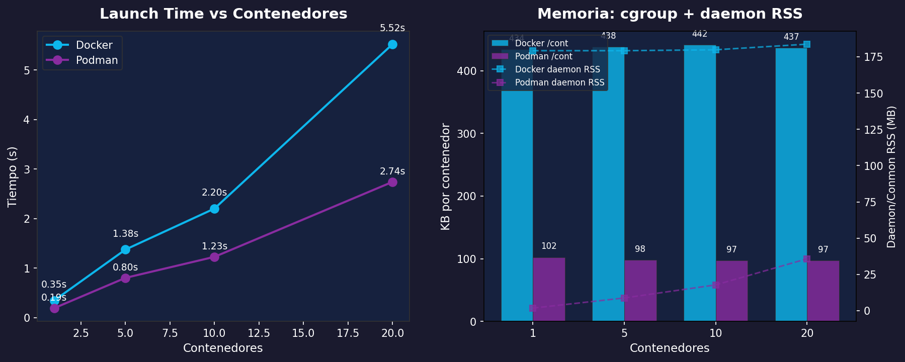
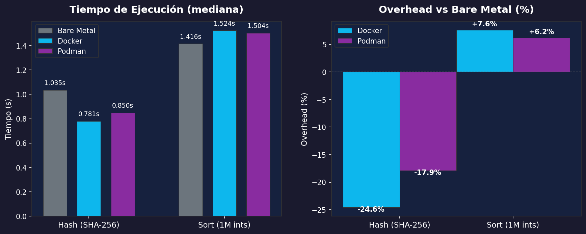

# Benchmarks: midiendo el rendimiento de contenedores

Los contenedores prometen ser "casi nativos" en rendimiento. Pero ¿qué tan cerca están? ¿Docker y Podman rinden igual? En esta sección vamos a **medir**, no asumir.

## Dos tipos de costo

Antes de medir, hay que separar dos costos completamente diferentes:

| Costo | ¿Cuándo ocurre? | ¿Qué incluye? |
|-------|-----------------|----------------|
| **LAUNCH** (arranque) | Una vez, al crear el contenedor | Crear namespaces, cgroups, montar overlay FS |
| **RUNNING** (ejecución) | Continuo, mientras el contenedor corre | Overhead de CPU/memoria del código ejecutándose *dentro* del contenedor |

Esta distinción es fundamental. Si confundes los dos, vas a creer que "los contenedores son 20% más lentos" cuando en realidad el overhead de *ejecución* puede ser ~0% y todo el costo viene del *arranque*.

Vamos a correr **tres experimentos** que miden cada costo por separado:

| # | Experimento | ¿Qué mide? | Tipo de costo |
|---|------------|-------------|---------------|
| 1 | Startup Latency | Tiempo para arrancar un contenedor | LAUNCH |
| 2 | Escalamiento y Recursos | Memoria y tiempo al lanzar N contenedores | LAUNCH + CAPACITY |
| 3 | Runtime Overhead | Overhead de CPU en contenedores ya corriendo | RUNNING |

> **Importante**: Los resultados varían según tu hardware, SO y versiones de Docker/Podman. Lo valioso no son los números exactos sino las **tendencias** y **proporciones**.

## Scripts de benchmark

Todos los scripts están en el directorio `scripts/` de este capítulo. Puedes correrlos individualmente o todos juntos:

```bash
# Correr todos los benchmarks
cd clase/08_containers/scripts
bash run_all.sh

# O correr uno específico
bash bench_startup.sh    # Exp 1: Startup latency
bash bench_scale.sh      # Exp 2: Escalamiento
bash bench_runtime.sh    # Exp 3: Runtime overhead

# Generar gráficas (requiere matplotlib)
pip install -r requirements.txt
python3 analyze.py
```

Los resultados (CSVs y gráficas PNG) se guardan en `scripts/results/`.

---

## Experimento 1: Startup Latency

**Objetivo**: ¿Cuánto tarda un contenedor en arrancar y ejecutar un comando simple comparado con ejecutarlo directamente? ¿Importa el tamaño de la imagen?

**Tipo de costo**: LAUNCH — todo el overhead es de creación del contenedor.

### ¿Qué medimos?

El tiempo de ejecutar `echo ok` en cinco combinaciones:
- **Bare metal**: directamente en tu shell
- **Docker** × Ubuntu y Alpine
- **Podman** × Ubuntu y Alpine

10 repeticiones por combinación, con 1 warm-up descartado. Reportamos la **mediana** (robusta a outliers) con rango intercuartílico (IQR).

### El script

```bash
#!/bin/bash
# bench_startup.sh — Mide latencia de arranque (LAUNCH cost)
# Prueba: Docker vs Podman × Ubuntu vs Alpine + bare metal
set -e

REPS=${1:-10}
OUTFILE="results/exp1_startup.csv"
mkdir -p results

echo "runtime,image,rep,startup_ms" > "$OUTFILE"

# Bare metal
for i in $(seq 1 "$REPS"); do
    start_ns=$(date +%s%N)
    echo ok > /dev/null
    end_ns=$(date +%s%N)
    ms=$(echo "scale=2; ($end_ns - $start_ns) / 1000000" | bc)
    echo "bare,none,$i,$ms" >> "$OUTFILE"
done

# Docker (Ubuntu + Alpine)
for image in ubuntu alpine; do
    docker pull -q "$image" > /dev/null 2>&1
    docker run --rm "$image" echo ok > /dev/null 2>&1  # warm-up
    for i in $(seq 1 "$REPS"); do
        start_ns=$(date +%s%N)
        docker run --rm "$image" echo ok > /dev/null 2>&1
        end_ns=$(date +%s%N)
        ms=$(echo "scale=2; ($end_ns - $start_ns) / 1000000" | bc)
        echo "docker,$image,$i,$ms" >> "$OUTFILE"
    done
done

# Podman (Ubuntu + Alpine)
# ... (mismo patrón)
```

### Resultados de referencia

Estos resultados se obtuvieron en nuestra máquina de prueba (Docker 28.4.0, Podman 4.6.2, Linux 6.12). 10 repeticiones por combo con un warm-up descartado.

**Datos crudos (10 repeticiones, en milisegundos):**

| Rep | Bare Metal | Docker/Ubuntu | Docker/Alpine | Podman/Ubuntu | Podman/Alpine |
|-----|-----------|---------------|---------------|---------------|---------------|
| 1 | 4.90 | 470.01 | 359.61 | 180.78 | 191.71 |
| 2 | 6.18 | 460.36 | 363.52 | 207.97 | 194.82 |
| 3 | 3.94 | 415.90 | 458.76 | 272.83 | 175.30 |
| 4 | 6.85 | 426.87 | 451.16 | 217.33 | 178.70 |
| 5 | 2.14 | 428.33 | 490.56 | 279.17 | 167.84 |
| 6 | 1.33 | 496.38 | 426.57 | 265.19 | 188.72 |
| 7 | 1.41 | 446.22 | 447.28 | 185.31 | 352.05 |
| 8 | 1.41 | 367.48 | 364.79 | 239.13 | 347.39 |
| 9 | 1.31 | 373.51 | 366.17 | 176.75 | 211.62 |
| 10 | 1.53 | 342.12 | 433.02 | 192.60 | 230.97 |

**Medianas y multiplicadores:**

| Runtime | Mediana | IQR | vs Bare Metal |
|---------|---------|-----|---------------|
| Bare Metal | **1.8 ms** | 1.3 - 4.9 ms | — |
| Docker / Ubuntu | **427.6 ms** | 373.5 - 460.4 ms | **~238x** |
| Docker / Alpine | **429.8 ms** | 363.5 - 451.2 ms | **~239x** |
| Podman / Ubuntu | **212.7 ms** | 180.8 - 265.2 ms | **~118x** |
| Podman / Alpine | **193.3 ms** | 175.3 - 230.9 ms | **~107x** |

### Análisis

**Podman es ~2x más rápido que Docker en startup.** ¿Por qué? La arquitectura es diferente:

- **Docker**: cliente → API REST → `dockerd` → `containerd` → `runc`. Cada paso es una llamada IPC. El daemon centralizado paga un costo fijo de comunicación por cada contenedor.
- **Podman**: `fork()` → `exec()` directo. Sin daemon intermediario. Menos saltos, menos overhead.

**Alpine vs Ubuntu: poca diferencia en Docker, algo en Podman.** ¿Por qué? El startup no descomprime la imagen — ya está descomprimida en el overlay. El tamaño importa para `docker pull` (Alpine: ~3 MB vs Ubuntu: ~29 MB), pero el arranque ya trabaja con capas locales. La diferencia pequeña en Podman (~213 vs ~193 ms) viene de que Alpine tiene menos archivos que montar en el overlay.

**La varianza alta de Podman** (IQR más amplio que Docker) es típica de la arquitectura fork-exec: cada `podman run` pasa por el caché de `fuse-overlayfs` que puede estar frío o caliente. Docker tiene un daemon con caché persistente — más lento en promedio pero más consistente.

> **Nota**: Tus resultados van a variar según tu hardware. Lo que importa es la **proporción**, no los números exactos.


:::exercise{title="Medir startup latency" difficulty="1"}

1. Ejecuta el benchmark:

```bash
cd scripts
bash bench_startup.sh 20
```

2. Revisa los resultados:

```bash
cat results/exp1_startup.csv
```

3. Compara las medianas de cada combinación runtime×imagen. ¿Cuántas veces más lento es Docker que bare metal? ¿Y Podman? ¿Alpine es más rápido que Ubuntu?

4. Ejecuta una segunda ronda. ¿Cambian las medianas? ¿Por qué podría ser? (Pista: caché del overlay filesystem)

:::

---

## Experimento 2: Escalamiento y Recursos

**Objetivo**: ¿Qué pasa cuando lanzamos muchos contenedores? ¿Cómo escalan el tiempo de arranque y la memoria? ¿Cuánto pesa el daemon de Docker vs los procesos `conmon` de Podman?

**Tipo de costo**: LAUNCH (tiempo) + CAPACITY (memoria).

### ¿Qué medimos?

Para 1, 5, 10 y 20 contenedores idle (`sleep 3600`):
1. **Tiempo de arranque total** (wall clock)
2. **Memoria por contenedor** vía `docker/podman stats` (lee `memory.current` del cgroup)
3. **Overhead del daemon**: RSS de `dockerd` o suma de RSS de todos los `conmon`

### ¿Qué es RSS?

**RSS** (Resident Set Size) es la cantidad de memoria física (RAM) que un proceso tiene **actualmente cargada** en memoria. No incluye memoria swappeada ni páginas compartidas con otros procesos — es lo que el proceso realmente está ocupando en RAM en este momento.

Cuando medimos "daemon RSS" estamos preguntando: ¿cuánta RAM real consume el daemon de Docker (`dockerd`) o los procesos `conmon` de Podman? Usamos el comando `ps -o rss=` que reporta RSS en kilobytes.

### ¿Por qué cgroup y no `free -m`?

Imagina que quieres pesar una carta. Tienes dos opciones:
- **Báscula de baño** (`free -m`): mide el peso total de tu cuerpo. El ruido (tu ropa, desayuno, postura) es de ±500g. Tu carta pesa 20g. La señal se pierde en el ruido.
- **Báscula postal** (cgroup `memory.current`): mide solo la carta. Precisión de ±0.1g.

`free -m` mide la memoria de **todo el sistema**. Entre una medición y otra, el kernel recicla page cache, libera buffers y compacta slab memory. Estas fluctuaciones son de ±50-150 MB — mucho más grandes que los ~400 KB que un contenedor idle realmente usa.

`docker stats` / `podman stats` lee `memory.current` del cgroup específico de cada contenedor. Es la memoria **exacta** que el kernel asignó a ese cgroup, inmune al ruido del sistema.

### El script


```bash
#!/bin/bash
# bench_scale.sh — Mide LAUNCH time + CAPACITY (memoria cgroup)
set -e

COUNTS=(1 5 10 20)
OUTFILE="results/exp2_scale.csv"

echo "runtime,count,launch_time_s,per_container_kb,total_container_kb,daemon_rss_kb" > "$OUTFILE"

# Helper: parsear memoria de docker/podman stats a KB
# Docker: "1.5MiB / 7.5GiB" (binary), Podman: "1.5MB / 7.5GB" (decimal)
parse_mem_to_kb() {
    local usage=$(echo "$1" | sed 's/ \/.*//' | xargs)
    local num=$(echo "$usage" | grep -oP '[\d.]+')
    local unit=$(echo "$usage" | grep -oP '[A-Za-z]+')
    case "$unit" in
        kB|KB) echo "$num" ;;
        KiB)   echo "$num" | awk '{printf "%.1f", $1 * 1.024}' ;;
        MB)    echo "$num" | awk '{printf "%.1f", $1 * 1000}' ;;
        MiB)   echo "$num" | awk '{printf "%.1f", $1 * 1024}' ;;
        # ... más unidades
    esac
}

for runtime in docker podman; do
    for count in "${COUNTS[@]}"; do
        # Lanzar contenedores y medir tiempo
        start_ns=$(date +%s%N)
        for i in $(seq 1 "$count"); do
            $runtime run -d --name "exp2_${runtime}_${count}_${i}" ubuntu sleep 3600
        done
        end_ns=$(date +%s%N)
        launch_s=$(echo "scale=3; ($end_ns - $start_ns) / 1000000000" | bc)

        # Memoria por contenedor vía stats (cgroup)
        $runtime stats --no-stream --format "{{.Name}},{{.MemUsage}}"

        # RSS del daemon
        ps -p $(pgrep -x dockerd) -o rss=  # Docker
        ps -C conmon -o rss=                # Podman (suma)

        # Cleanup
    done
done
```


### Resultados de referencia

**Datos crudos:**

| Runtime | N | Launch (s) | KB/cont (cgroup) | Daemon RSS (KB) |
|---------|---|-----------|-------------------|-----------------|
| Docker | 1 | 0.35 | 434 | 183,540 |
| Docker | 5 | 1.38 | 438 | 183,540 |
| Docker | 10 | 2.20 | 442 | 184,180 |
| Docker | 20 | 5.52 | 437 | 188,148 |
| Podman | 1 | 0.19 | 102 | 1,784 |
| Podman | 5 | 0.80 | 98 | 8,960 |
| Podman | 10 | 1.23 | 97 | 18,184 |
| Podman | 20 | 2.74 | 97 | 36,628 |

**Comparación directa a 20 contenedores:**

| Métrica | Docker | Podman | Diferencia |
|---------|--------|--------|------------|
| Launch time | 5.52s | 2.74s | Podman **2x más rápido** |
| Memoria/cont (cgroup) | 437 KB | 97 KB | Podman **4.5x menos** |
| Daemon/conmon RSS | 184 MB | 36 MB | Podman **5x menos** |
| Memoria total | 184 MB + 8.7 MB = **193 MB** | 36 MB + 1.9 MB = **38 MB** | Podman **5x menos** |

### Análisis

**Tiempos de arranque — escalamiento lineal:**

| N | Docker | Docker ms/cont | Podman | Podman ms/cont |
|---|--------|---------------|--------|---------------|
| 1 | 0.35s | 350 ms | 0.19s | 190 ms |
| 5 | 1.38s | 276 ms | 0.80s | 160 ms |
| 10 | 2.20s | 220 ms | 1.23s | 123 ms |
| 20 | 5.52s | 276 ms | 2.74s | 137 ms |

Podman escala de forma más consistente (~130-190 ms/cont) porque cada contenedor es un proceso independiente — no hay cuello de botella central. Docker varía más (220-350 ms/cont) por la serialización en el daemon.

**El "impuesto del daemon":**

Docker carga un daemon `dockerd` que consume ~184 MB de RSS **con 0 o con 20 contenedores**. Este es un costo fijo que pagas por tener Docker instalado, antes de lanzar un solo contenedor.

Podman no tiene daemon. Cada contenedor tiene un proceso `conmon` (container monitor) que crece linealmente: ~1.8 MB × N contenedores. Para pocos contenedores (<100), Podman usa **mucha menos** memoria total.

**¿A cuántos contenedores necesitas para que Podman supere a Docker en memoria total?** Si `conmon` usa ~1.8 MB por contenedor y Docker usa ~184 MB fijos: `184 MB / 1.8 MB ≈ 102 contenedores`. A partir de ~100 contenedores, el modelo de Podman se vuelve más costoso que el daemon fijo de Docker. Pero en la práctica, pocas máquinas corren 100+ contenedores.

**Memoria cgroup — por qué cgroup > `free -m`:**

Docker usa ~437 KB por contenedor (cgroup). Podman usa ~97 KB. Estos números son **estables** con 1, 5, 10 o 20 contenedores — exactamente lo que esperamos de un instrumento preciso.

Compáralo con `free -m` que reporta fluctuaciones de ±50-150 MB. Con `free -m` nunca hubieras podido medir los 437 KB que un contenedor Docker realmente usa — el ruido del sistema es **100,000x mayor** que la señal.

> **Lección de benchmarking**: Siempre usa el instrumento más específico disponible. `docker stats` lee el cgroup exacto del contenedor, inmune al ruido del sistema.



:::exercise{title="Medir escalamiento" difficulty="3"}

1. Ejecuta:

```bash
bash bench_scale.sh
```

2. Revisa el CSV y responde:
   - ¿El escalamiento del launch time es lineal? ¿Cuántos ms/contenedor en cada runtime?
   - ¿Cuánta memoria usa el daemon de Docker sin contenedores?
   - ¿A cuántos contenedores llenarías tu RAM? Calcula: `RAM_disponible / (cgroup_per_container + daemon_overhead_per_container)`

3. Compara los datos de cgroup con lo que reportaría `free -m` (puedes medir el delta de `free -m` antes y después de lanzar 20 contenedores). ¿Cuánto ruido hay?

:::

---

## Experimento 3: Runtime Overhead

**Objetivo**: Los Experimentos 1 y 2 midieron el costo de **LAUNCH**. Ahora medimos el costo de **RUNNING**: ¿cuánto overhead de CPU agrega un contenedor que *ya está corriendo*?

**Tipo de costo**: RUNNING — el contenedor ya existe, solo medimos el trabajo dentro de él.

### ¿Qué medimos?

Pre-iniciamos contenedores Docker y Podman (`sleep 3600`), luego ejecutamos dos workloads vía `exec` (que entra al contenedor sin crear uno nuevo):

1. **Hash** (CPU puro, aritmética entera):
   ```bash
   dd if=/dev/urandom bs=1M count=100 2>/dev/null | sha256sum > /dev/null
   ```
   Lee 100 MB de `/dev/urandom` y calcula SHA-256. Es puro cómputo — no toca el disco real.

2. **Sort** (CPU + memoria + pipes):
   ```bash
   seq 1 1000000 | shuf | sort -n > /dev/null
   ```
   Genera 1 millón de números, los baraja y los ordena. Usa CPU, aloca memoria para el buffer de sort, y encadena 3 procesos con pipes.

5 repeticiones por combinación (1 warm-up descartado). Reportamos mediana.

### El script

```bash
#!/bin/bash
# bench_runtime.sh — Mide RUNNING cost vía exec en contenedores ya corriendo
set -e

REPS=${1:-5}

# Pre-iniciar contenedores
docker run -d --name exp3_docker ubuntu sleep 3600
podman run -d --name exp3_podman ubuntu sleep 3600
sleep 1

HASH_CMD='dd if=/dev/urandom bs=1M count=100 2>/dev/null | sha256sum > /dev/null'
SORT_CMD='seq 1 1000000 | shuf | sort -n > /dev/null'

for workload in hash sort; do
    # Bare metal
    bash -c "$CMD"                                 # warm-up
    time bash -c "$CMD"                            # medir

    # Docker exec (sin startup — el contenedor ya corre)
    docker exec exp3_docker bash -c "$CMD"         # warm-up
    time docker exec exp3_docker bash -c "$CMD"    # medir

    # Podman exec
    podman exec exp3_podman bash -c "$CMD"         # warm-up
    time podman exec exp3_podman bash -c "$CMD"    # medir
done

# Cleanup
docker rm -f exp3_docker
podman rm -f exp3_podman
```

### Resultados de referencia

**Datos crudos — Hash (SHA-256 de 100 MB, en segundos):**

| Rep | Bare Metal | Docker exec | Podman exec |
|-----|-----------|-------------|-------------|
| 1 | 1.035 | 0.771 | 0.850 |
| 2 | 1.050 | 0.815 | 0.810 |
| 3 | 0.925 | 0.827 | 0.795 |
| 4 | 1.003 | 0.730 | 0.875 |
| 5 | 1.075 | 0.781 | 0.868 |

**Datos crudos — Sort (1M enteros, en segundos):**

| Rep | Bare Metal | Docker exec | Podman exec |
|-----|-----------|-------------|-------------|
| 1 | 1.392 | 1.392 | 1.467 |
| 2 | 1.439 | 1.385 | 1.498 |
| 3 | 1.416 | 1.524 | 1.533 |
| 4 | 1.362 | 1.553 | 1.504 |
| 5 | 1.459 | 1.640 | 1.549 |

**Medianas y overhead:**

| Runtime | Hash (mediana) | Hash overhead | Sort (mediana) | Sort overhead |
|---------|---------------|--------------|----------------|--------------|
| Bare Metal | **1.035s** | — | **1.416s** | — |
| Docker exec | **0.781s** | **-24.6%** | **1.524s** | **+7.6%** |
| Podman exec | **0.850s** | **-17.9%** | **1.504s** | **+6.2%** |

### Análisis

**Hash: ¿los contenedores son más rápidos que bare metal?**

No realmente. La diferencia viene de cómo se accede a `/dev/urandom`:
- En **bare metal**, `dd` lee `/dev/urandom` a través del **VFS** del kernel directamente.
- En **contenedores**, la lectura pasa por la capa del namespace, que en algunos kernels tiene un path ligeramente diferente hacia el generador de números aleatorios.

**¿Qué es el VFS?** VFS (Virtual File System) es la capa de abstracción del kernel de Linux que permite que todos los filesystems (ext4, overlay, procfs, `/dev/urandom`, etc.) se accedan con la misma interfaz (`open`, `read`, `write`, `close`). Cuando un programa lee un archivo, no habla directamente con el disco o el dispositivo — habla con el VFS, y el VFS despacha la operación al driver correcto. En un contenedor, el VFS pasa por capas adicionales (el overlay filesystem, el mount namespace) antes de llegar al recurso real.

Los tiempos absolutos (~0.8-1.0s) son tan cortos que la diferencia está dominada por varianza del scheduler y estado del caché de CPU. El resultado correcto es: **para hash, el overhead del contenedor es ~0%** — las diferencias son ruido del sistema.

**Sort: overhead real pero pequeño (+6-8%).**

Sort es un workload más interesante porque:
- Aloca ~20 MB de memoria para el buffer de ordenamiento
- Crea 3 procesos (seq, shuf, sort) conectados por pipes
- Las **syscalls** pasan por la capa del namespace

**¿Qué son las syscalls?** Una **syscall** (system call) es la forma en que un programa le pide algo al kernel del sistema operativo. Los programas no pueden acceder al hardware directamente — tienen que pedírselo al kernel a través de syscalls. Cada operación fundamental es una syscall:

- **`read()`** / **`write()`**: leer/escribir datos (en archivos, pipes, sockets, dispositivos). Cuando `seq` escribe números al pipe y `sort` los lee, cada transferencia es un par de syscalls `write()` + `read()`.
- **`mmap()`**: pedir al kernel que mapee un bloque de memoria al espacio del proceso. Cuando `sort` necesita 20 MB para su buffer de ordenamiento, usa `mmap()` para pedírselo al kernel.
- **`open()`** / **`close()`**: abrir/cerrar archivos o dispositivos.

En bare metal, estas syscalls van directo al kernel. En un contenedor, cada syscall pasa por **capas adicionales**: el kernel verifica el namespace (¿este proceso tiene permiso de acceder a este recurso en su namespace?), el cgroup (¿ha excedido su límite de memoria?), y el overlay filesystem (¿en qué capa está este archivo?). Cada verificación agrega microsegundos, y con 1 millón de números fluyendo por 3 procesos conectados por pipes, esos microsegundos se acumulan hasta el +6-8% de overhead que observamos.

**LAUNCH vs RUNNING — la prueba final:**

| Métrica | Docker `run` (Exp 1) | Docker `exec` (Exp 3) |
|---------|---------------------|----------------------|
| Latencia típica | ~428 ms | < 1 ms (solo la syscall exec) |
| Overhead de CPU | Incluido en el tiempo total | +0-8% (depende del workload) |

El arranque cuesta ~428 ms. La ejecución dentro de un contenedor ya corriendo cuesta +0-8% extra. Si tu tarea tarda 2 horas en ejecutar, el overhead del contenedor es **menos de 10 minutos** — y el arranque es un parpadeo.

> **Conclusión**: Para tareas de cómputo (data science, ML, procesamiento batch), el overhead de RUNNING es despreciable. El costo real está en el LAUNCH, y ese costo se paga una sola vez.



:::exercise{title="Medir runtime overhead" difficulty="2"}

1. Ejecuta:

```bash
bash bench_runtime.sh 10
```

2. Calcula el overhead porcentual de cada workload: `(mediana_contenedor - mediana_bare) / mediana_bare × 100`

3. ¿Por qué el overhead es diferente entre hash y sort? Piensa en qué syscalls hace cada workload.

4. Inventa un tercer workload que maximice el overhead del contenedor. Pista: piensa en operaciones que involucren muchas syscalls al filesystem.

:::

---

## Tabla resumen

| Aspecto | Docker | Podman | Veredicto |
|---------|--------|--------|-----------|
| **Startup** (Ubuntu) | ~428 ms | ~213 ms | Podman 2x más rápido |
| **Startup** (Alpine) | ~430 ms | ~193 ms | Podman 2.2x más rápido |
| **Launch time** (20 cont.) | 5.52s | 2.74s | Podman 2x más rápido |
| **Memoria cgroup** | ~437 KB/cont | ~97 KB/cont | Podman 4.5x menos |
| **Daemon RSS** | ~184 MB (fijo) | ~1.8 MB × N | Podman sin daemon |
| **Runtime overhead** (hash) | ~0% | ~0% | Ambos ~nativo |
| **Runtime overhead** (sort) | +7.6% | +6.2% | Ambos bajo |

## Conclusiones

1. **El overhead de RUNNING es casi cero.** El Exp 3 demostró que para workloads de CPU puro (hash), Docker y Podman no agregan overhead medible. Para workloads con syscalls intensivas (sort), el overhead es ~6-8%. Para tareas de cómputo reales (ML, data science), esto es despreciable.

2. **El costo real es el LAUNCH.** Crear namespaces, montar overlays y configurar cgroups toma cientos de milisegundos (~200-430 ms). Esto importa si creas/destruyes contenedores frecuentemente (serverless, CI/CD con jobs cortos). Para contenedores de larga vida (servidores, notebooks), se paga una vez y se olvida.

3. **Podman sorprende en rendimiento.** Contrario a la sabiduría convencional ("Docker es más rápido porque tiene daemon pre-calentado"), Podman fue ~2x más rápido en startup y escalamiento. El modelo fork-exec sin daemon elimina el cuello de botella central del API de Docker.

4. **La herramienta de medición importa.** `free -m` fluctúa ±50-150 MB entre mediciones — inútil para medir contenedores que usan ~400 KB. `docker stats` lee el cgroup exacto y da la señal pura. Siempre usa el instrumento más específico disponible.

5. **Sin daemon = sin impuesto fijo.** Docker consume ~184 MB de RAM con cero contenedores. Podman consume 0 MB base + ~1.8 MB por contenedor vía `conmon`. Para pocas decenas de contenedores, la arquitectura sin daemon de Podman usa significativamente menos memoria.

## Nota sobre I/O y contenedores anidados

Dos temas que no incluimos como experimentos pero vale la pena mencionar:

**Disk I/O**: El overlay filesystem tiene overhead real (~20% más lento que bare metal para escrituras). La solución es simple: **usa volúmenes montados** (`-v /host/path:/container/path`) para operaciones intensivas de I/O (bases de datos, logs, archivos grandes). Los volúmenes bypasean el overlay y escriben directamente al filesystem del host, recuperando rendimiento nativo.

**Contenedores anidados**: Correr contenedores dentro de contenedores es difícil y requiere configuración especial. En Docker, el patrón práctico es montar el socket del daemon del host (`-v /var/run/docker.sock:/var/run/docker.sock`). En Podman, se necesita `--privileged`. Ambos tienen implicaciones de seguridad importantes. Para CI/CD, investiga alternativas como **Kaniko** (builds de imágenes sin daemon) o **Buildah** (builds OCI sin daemon).

:::prompt{title="Analizar resultados de benchmarks" for="ChatGPT/Claude"}

Ejecuté benchmarks de contenedores (Docker vs Podman vs bare metal) y obtuve estos resultados:

```
[pega los contenidos de tus CSVs o la salida del benchmark aquí]
```

Mi hardware es:
- CPU: [modelo]
- RAM: [cantidad]
- Disco: [SSD/HDD]
- SO: [distribución y versión]

Analiza mis resultados:
1. ¿Son normales para mi hardware?
2. ¿Qué explica las diferencias que observo entre Docker y Podman?
3. ¿Hay algo inesperado que debería investigar?
4. ¿Cuánto overhead real tiene RUNNING vs LAUNCH en mis datos?

:::
