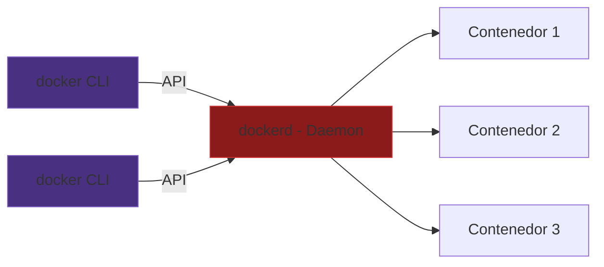
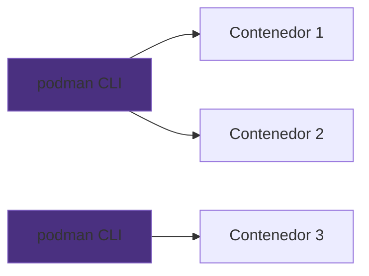

# Podman

Ya sabes usar Docker. Podman es la alternativa — mismos conceptos, mismos comandos, pero con una arquitectura fundamentalmente diferente que resuelve varios problemas de Docker.

Esta sección **no** repite lo que ya vimos. Se enfoca en **qué hace Podman diferente** y **cuándo elegir uno u otro**.

## Arquitectura: el daemon vs sin daemon

La diferencia más importante entre Docker y Podman es arquitectónica.

### Docker: cliente → daemon → contenedor



### Podman: cliente → contenedor (directo)



En Docker, todo pasa por el daemon. En Podman, cada contenedor es un **proceso hijo directo** del comando que lo lanzó.

## El daemon: la gran diferencia

El daemon de Docker (`dockerd`) es un proceso que corre **como root**, **siempre en segundo plano**, y que **todos los contenedores necesitan**.

### Problemas del daemon

| Problema | Consecuencia |
|----------|-------------|
| **Punto único de fallo** | Si el daemon se cae, **todos** los contenedores mueren |
| **Corre como root** | Un exploit en el daemon = acceso root al host |
| **Siempre corriendo** | Consume recursos incluso sin contenedores activos |
| **Proceso intermedio** | Los contenedores no son hijos directos de tu shell |

### Podman no tiene daemon

Podman usa un modelo **fork-exec**: cada `podman run` crea directamente un proceso contenedor. No hay intermediario.

```bash
# En Docker, tus contenedores son hijos del daemon:
# shell → docker CLI → dockerd → containerd → runc → contenedor

# En Podman, tus contenedores son hijos de tu shell:
# shell → podman → conmon → contenedor
```

Esto significa:
- Si `podman` se cierra, los contenedores **siguen corriendo** (manejados por `conmon`)
- No hay proceso centralizado que pueda fallar
- No necesitas un servicio de sistema corriendo

## Rootless por defecto

Docker tradicionalmente necesita permisos de **root** para funcionar. Esto se debe al daemon — necesita privilegios elevados para crear namespaces y cgroups.

Podman funciona **sin root** por defecto. Usa user namespaces para que un usuario normal pueda crear y ejecutar contenedores sin privilegios elevados.

```bash
# Docker: generalmente necesitas sudo o estar en el grupo 'docker'
sudo docker run ubuntu echo "hola"
# (o agregar tu usuario al grupo docker, que es equivalente a dar root)

# Podman: funciona directamente con tu usuario
podman run ubuntu echo "hola"
```

¿Por qué importa?

| Aspecto | Docker (root) | Podman (rootless) |
|---------|--------------|-------------------|
| **Seguridad** | Un escape del contenedor = root en el host | Un escape del contenedor = tu usuario (sin privilegios) |
| **Instalación** | Necesitas permisos de administrador | Funciona sin permisos especiales |
| **Ambientes compartidos** | Riesgo en servidores multiusuario | Seguro para ambientes compartidos |
| **CI/CD** | Necesitas Docker-in-Docker (complejo) | Funciona en pipelines sin privilegios |

> **Nota**: Docker ahora soporta modo rootless también, pero no es el default y requiere configuración adicional.

## Comparación Docker vs Podman

| Aspecto | Docker | Podman |
|---------|--------|--------|
| **Daemon** | Sí (dockerd) | No |
| **Root por defecto** | Sí | No (rootless) |
| **Formato de imagen** | OCI / Docker | OCI / Docker |
| **Comandos** | `docker ...` | `podman ...` (misma sintaxis) |
| **Docker Compose** | Nativo | `podman-compose` o compatibilidad |
| **Pods** | No (concepto de Kubernetes) | Sí, pods nativos |
| **Ecosistema** | Más grande, más documentación | Creciendo rápidamente |
| **Plataformas** | Linux, macOS, Windows | Linux nativo, macOS/Windows via máquina virtual |
| **Systemd** | Integración manual | `podman generate systemd` nativo |

## Comandos: casi idénticos

La mayoría de los comandos de Docker funcionan **exactamente igual** en Podman. Puedes incluso crear un alias:

```bash
alias docker=podman  # y todo funciona (casi) igual
```

| Operación | Docker | Podman |
|-----------|--------|--------|
| Ejecutar contenedor | `docker run -it ubuntu bash` | `podman run -it ubuntu bash` |
| Listar contenedores | `docker ps` | `podman ps` |
| Construir imagen | `docker build -t app .` | `podman build -t app .` |
| Ver imágenes | `docker images` | `podman images` |
| Detener contenedor | `docker stop mi-app` | `podman stop mi-app` |
| Eliminar contenedor | `docker rm mi-app` | `podman rm mi-app` |
| Ver logs | `docker logs mi-app` | `podman logs mi-app` |
| Ejecutar en contenedor | `docker exec -it mi-app bash` | `podman exec -it mi-app bash` |
| Inspeccionar | `docker inspect mi-app` | `podman inspect mi-app` |
| Limpieza | `docker system prune` | `podman system prune` |

### Diferencias en la práctica

Las diferencias que sí vas a notar:

```bash
# 1. Registry por defecto
docker pull ubuntu          # busca en Docker Hub automáticamente
podman pull ubuntu          # te pregunta qué registry usar (docker.io, quay.io, etc.)

# 2. Socket del daemon
docker info                 # se conecta al daemon por /var/run/docker.sock
podman info                 # no hay daemon, lee la configuración directamente

# 3. Compose
docker compose up           # docker compose (plugin integrado)
podman-compose up           # necesita instalación separada
# O bien:
podman compose up           # si tienes docker-compose instalado y el socket habilitado
```

## Pods: un concepto extra

Podman tiene un concepto que Docker no: **pods**. Un pod es un grupo de contenedores que comparten la misma red y pueden comunicarse entre sí por `localhost`.

```mermaid
graph TB
    subgraph Pod[Pod: mi-app]
        C1[web - nginx:80]
        C2[api - python:5000]
        C3[db - postgres:5432]
    end
    Pod --> NET[Red compartida: localhost]

    style Pod fill:#1a3a5c,stroke:#2a6a9c
    style NET fill:#2d5a1e,stroke:#4a8f32
```



```bash
# Crear un pod
podman pod create --name mi-app -p 8080:80

# Agregar contenedores al pod
podman run -d --pod mi-app --name web nginx
podman run -d --pod mi-app --name api python:3.11

# Los contenedores se comunican por localhost
# 'web' puede acceder a 'api' en localhost:5000
```

Los pods de Podman son conceptualmente iguales a los pods de Kubernetes. Si vas a trabajar con Kubernetes, esta familiaridad es una ventaja.

## ¿Cuándo elegir Docker vs Podman?

| Escenario | Recomendación | ¿Por qué? |
|-----------|---------------|------------|
| Aprendiendo contenedores | Cualquiera (ambos) | Los comandos son iguales |
| Desarrollo local | Docker | Mejor ecosistema, Docker Compose, más documentación |
| Servidor de producción | Podman | Rootless, sin daemon, más seguro |
| CI/CD sin privilegios | Podman | No necesita daemon ni root |
| Equipo que ya usa Docker | Docker | Compatibilidad con herramientas existentes |
| Prepararse para Kubernetes | Podman | Concepto de pods nativo |
| Ambientes multiusuario | Podman | Aislación rootless por defecto |
| Rendimiento a escala | Podman | Sin daemon central, escala mejor (ver Módulo 8.4) |

En la práctica, **saber uno es saber el otro**. Las diferencias son arquitectónicas, no de uso diario.

## Ejercicios

:::exercise{title="Podman básico" difficulty="1"}

1. Ejecuta el mismo contenedor con Docker y con Podman:

```bash
docker run --rm ubuntu echo "Hola desde Docker"
podman run --rm ubuntu echo "Hola desde Podman"
```

2. Compara la salida de información del sistema:

```bash
docker info | head -20
podman info | head -20
```

¿Qué diferencias notas? Busca específicamente:
- ¿Menciona un daemon?
- ¿Qué storage driver usa cada uno?
- ¿Qué runtime usa cada uno?

:::

:::exercise{title="Misma imagen, ambos runtimes" difficulty="2"}

Vamos a verificar que la **misma imagen** funciona igual en ambos runtimes.

1. Crea un directorio de trabajo y un `Dockerfile`:

```bash
mkdir test-ambos && cd test-ambos
```

```dockerfile
FROM ubuntu:22.04
RUN apt-get update && apt-get install -y curl
WORKDIR /app
COPY <<'SCRIPT' test.sh
#!/bin/bash
echo "Runtime: ${CONTAINER_RUNTIME:-desconocido}"
echo "Hostname: $(hostname)"
echo "User: $(whoami)"
echo "UID: $(id -u)"
SCRIPT
RUN chmod +x test.sh
CMD ["./test.sh"]
```

2. Construye con ambos:

```bash
docker build -t test-imagen .
podman build -t test-imagen .
```

3. Ejecuta con ambos, pasando una variable para identificar el runtime:

```bash
docker run --rm -e CONTAINER_RUNTIME=docker test-imagen
podman run --rm -e CONTAINER_RUNTIME=podman test-imagen
```

4. Compara: ¿Qué es igual? ¿Qué es diferente? Presta atención al UID.

:::

:::exercise{title="Rootless en acción" difficulty="2"}

Este ejercicio demuestra la diferencia de seguridad entre rootful y rootless.

1. En Docker, verifica quién eres dentro del contenedor:

```bash
docker run --rm ubuntu id
# uid=0(root) gid=0(root) ...
```

2. En Podman (rootless), verifica:

```bash
podman run --rm ubuntu id
# uid=0(root) ... pero este root NO es root en el host
```

3. Verifiquemos. En Docker, crea un archivo como root:

```bash
docker run --rm -v /tmp:/host_tmp ubuntu touch /host_tmp/docker_test
ls -la /tmp/docker_test
# ¿Quién es el dueño? ¿root?
```

4. En Podman rootless, haz lo mismo:

```bash
podman run --rm -v /tmp:/host_tmp ubuntu touch /host_tmp/podman_test
ls -la /tmp/podman_test
# ¿Quién es el dueño ahora?
```

5. ¿Qué implicaciones de seguridad tiene esta diferencia?

:::

:::prompt{title="Migrar de Docker a Podman" for="ChatGPT/Claude"}

Estoy migrando un proyecto de Docker a Podman. Mi configuración actual es:

**docker-compose.yml:**

```yaml
[pega tu docker-compose.yml aquí]
```

**Problemas encontrados:**

```
[pega errores o diferencias que hayas notado]
```

¿Qué necesito cambiar para que funcione con Podman? ¿Hay incompatibilidades que deba conocer?

:::
