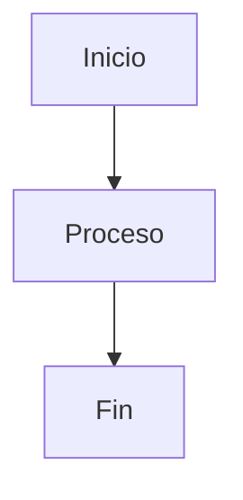
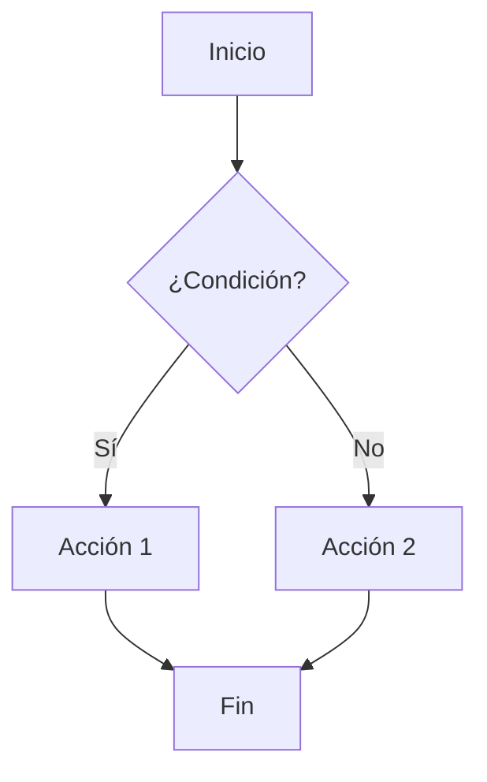
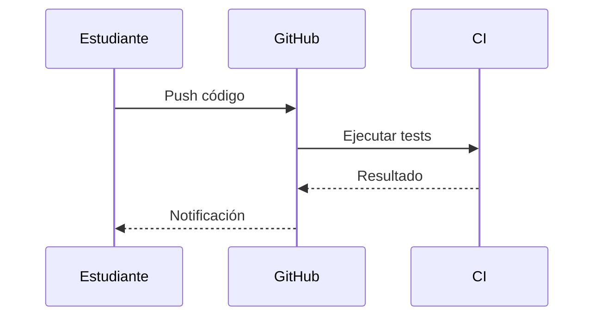
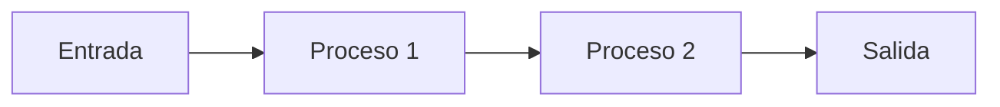
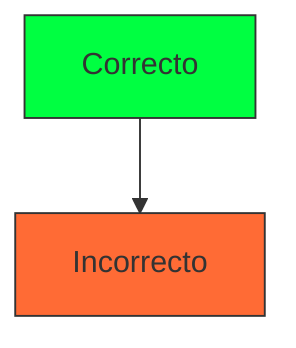
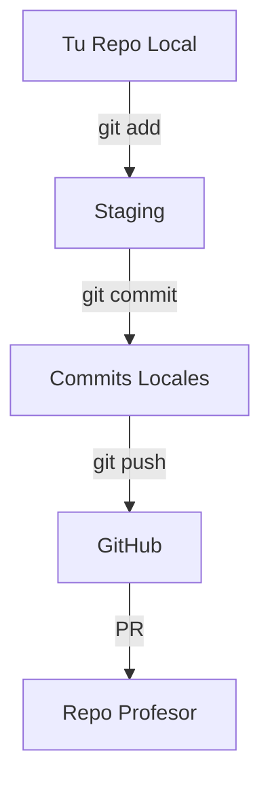
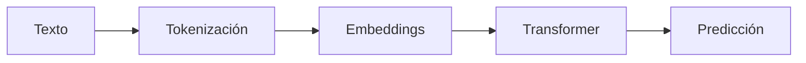
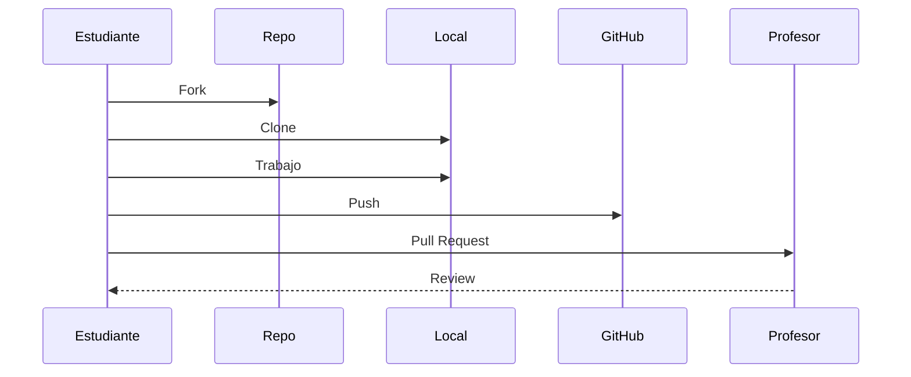
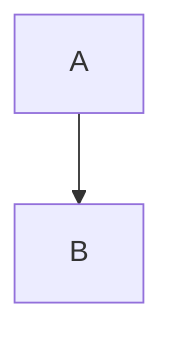

# Diagramas Mermaid

Cómo crear diagramas de flujo, secuencia y más.

## Sintaxis Básica

````markdown

````

## Tipos de Diagramas

### Diagrama de Flujo



**Código:**
````markdown

````

### Diagrama de Secuencia



**Código:**
````markdown

````

### Diagrama de Flujo Horizontal



**Código:**
````markdown

````

---

## Formas de Nodos

| Sintaxis | Forma |
|----------|-------|
| `A[Texto]` | Rectángulo |
| `A(Texto)` | Rectángulo redondeado |
| `A{Texto}` | Diamante (decisión) |
| `A((Texto))` | Círculo |
| `A>Texto]` | Bandera |

---

## Tipos de Flechas

| Sintaxis | Tipo |
|----------|------|
| `-->` | Flecha sólida |
| `---` | Línea sólida |
| `-.-` | Línea punteada |
| `-.->` | Flecha punteada |
| `==>` | Flecha gruesa |
| `-->|texto|` | Flecha con etiqueta |

---

## Estilos

Puedes agregar colores con `style`:

````markdown

````

Colores del tema Eva01:
- Verde: `#00ff41`
- Morado: `#9d4edd`
- Naranja: `#ff6b35`
- Rojo: `#ef233c`

---

## Características Especiales

### Click para Expandir

Los diagramas tienen un botón "Expandir" que abre el diagrama en pantalla completa.

### Tema Automático

Los diagramas adaptan sus colores al tema actual (oscuro/claro).

---

## Ejemplos del Curso

### Flujo de Git

````markdown

````

### Proceso de LLM

````markdown

````

### Workflow de Tareas

````markdown

````

---

## Consejos

1. **Mantén los diagramas simples** - Máximo 8-10 nodos
2. **Usa etiquetas descriptivas** - Texto corto y claro
3. **Orienta el flujo** - TD (arriba-abajo) o LR (izquierda-derecha)
4. **Prueba localmente** - Verifica que renderiza bien

---

## Recursos

- [Documentación oficial de Mermaid](https://mermaid.js.org/)
- [Editor en línea](https://mermaid.live/)

---

## En producción (uu_framework): cómo se renderiza Mermaid

En este sitio, Mermaid se renderiza **del lado del cliente** (en el navegador) desde el layout base.

Puntos importantes para que funcione en deployment:

1. **Siempre usa un bloque fenced con `mermaid`** (esto es lo que genera la clase `language-mermaid`):

````markdown

````

2. **No indentes** el bloque ` ```mermaid ` (si lo indentas dentro de listas o quotes, a veces deja de detectarse como `language-mermaid`).
3. **Tema automático**: el sitio configura Mermaid con tema oscuro/claro según el tema del sitio.  
   - Recomendación: **evita hardcodear colores** salvo que sea necesario, porque pueden verse mal en modo claro.
4. **Diagrama expandible**: los diagramas se envuelven en un contenedor con botón “Expandir” (modal).
5. **Requisito de red**: Mermaid se carga desde un CDN. Si alguien abre el sitio sin internet, los diagramas no se renderizan.
